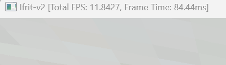
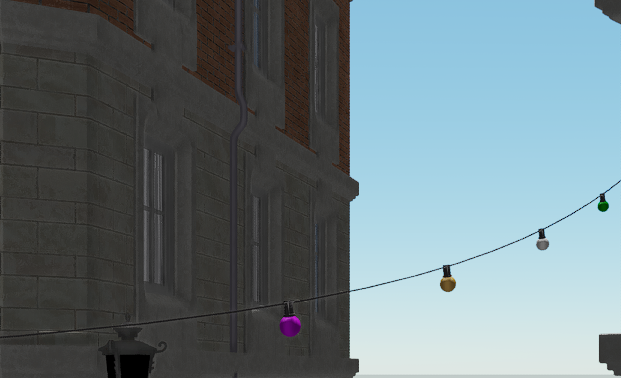
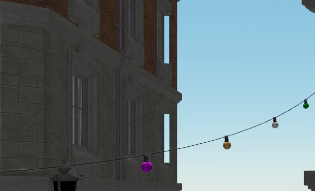
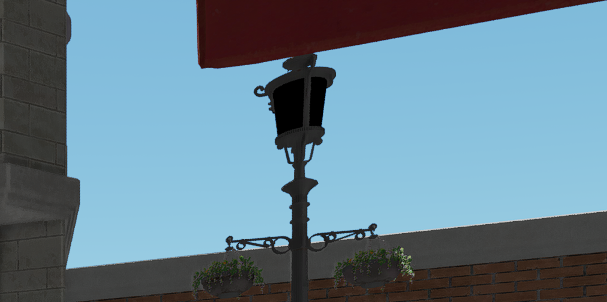
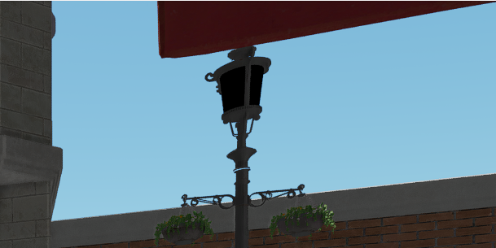

# Ifrit-v2 /  TODO 

### Pending

- Ayanami: 非封闭网格(尤其是One-sided Mesh)的MDF存在较严重Artifact.
  - 可行参考：https://advances.realtimerendering.com/s2022/SIGGRAPH2022-Advances-Lumen-Wright%20et%20al.pdf
  - 可行缓解：(A) UDF + DF Expansion (B) Virtual Surface

- Ayanami: 是否可行的SDF的BC4压缩；部分区域压缩后导致精度丢失Artifacts

  - 参考：https://jcgt.org/published/0011/03/06/paper-lowres.pdf

    

### Resolved

#### 2025.05

- Runtime: 修复HiZ的错误Layout导致RenderDoc的错误显示 (250530)

- Ayanami: 修复浮点误差导致的Surface Cache近平面丢失 (250529)

- Build: 降低编译耗时 (PCH, spdlog由head only转库文件，移除cereal冗余archive) (250501)

  | After Fixing       | Before Fixing   |
  | ------------------ | --------------- |
  | 编译用时: 4min 30s | 编译用时: 11min |

#### 2025.04

- Ayanami: 缓解 SDF RayMarching （包括离线Shadow Mask生成）的高延迟和内存带宽(Nsight Graphics: Long Scoreboard)：停止无效步进，优化DF Shadow Culling包围盒，调整Object Grid的Culling和Sort策略，自适应MDF体积，引入MDF的BC4压缩。(250412)

  | After Fixing                                                 | Before Fixing                                                |
  | ------------------------------------------------------------ | ------------------------------------------------------------ |
  | (包括强制GDF Object Grids/Direct Lighting Atlas重生成) 帧用时: 84.1 ms (-80.6%)  | (包括强制GDF Object Grids/Direct Lighting Atlas重生成) 帧用时: 433.1 ms  |
  | (Syaro GBuffer/CSM+完全的Direct Lighting Atlas重生成+Obj Grid 的Albedo Atlas可视化) 帧用时: 19.51 ms (2501413) | (Syaro GBuffer/CSM+完全的Direct Lighting Atlas重生成+Obj Grid 的Albedo Atlas可视化) 帧用时:  待测试   |

  

- Ayanami: 缓解 DF Shadow Culling 的错误和重复问题 (250407)

  | After Fixing                                                 | Before Fixing                                                |
  | ------------------------------------------------------------ | ------------------------------------------------------------ |
  |  |  |

    

- VkGraphics: 修复AllocateCommandBuffer导致的内存泄漏 (250404)

  - 参考：https://developer.download.nvidia.com/gameworks/events/GDC2016/Vulkan_Essentials_GDC16_tlorach.pdf#page=25.00

#### 2025.03

- RHI: RHI资源引用计数和待删除队列 (250325)

- Syaro: 修复错误的Cluster Group Culling (250324)

#### 2025.01
- Syaro: 缓解LoD切换时的顶点属性突变 (250115)

  | After Fixing                                       | Before Fixing                                      |
  | -------------------------------------------------- | -------------------------------------------------- |
  |  |  |

- Syaro: 由HiZ采样位置错误导致的图元丢失 (250111)

  | After Fixing                                                 | Before Fixing                                                |
  | ------------------------------------------------------------ | ------------------------------------------------------------ |
  |  |  |

- Syaro: 由软渲染采样位置错误导致的图元丢失 (250111)

  | After Fixing                                                 | Before Fixing                                                |
  | ------------------------------------------------------------ | ------------------------------------------------------------ |
  |  |  |

  

- Syaro: FSR2 移动时的闪烁和拖影 (250110)

- Syaro: 由引用已析构的对象造成的第一帧的View信息无效. (250103)

- Syaro: CSM UV 溢出, 导致错误的AABB初始化 (250103)

- Syaro: GLTF 错误的节点变换 (250103)

- Syaro: CSM 移动时闪烁

  