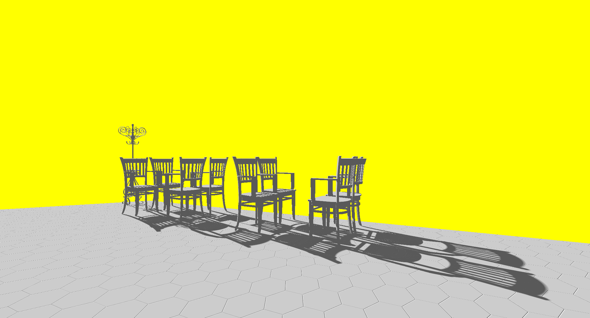
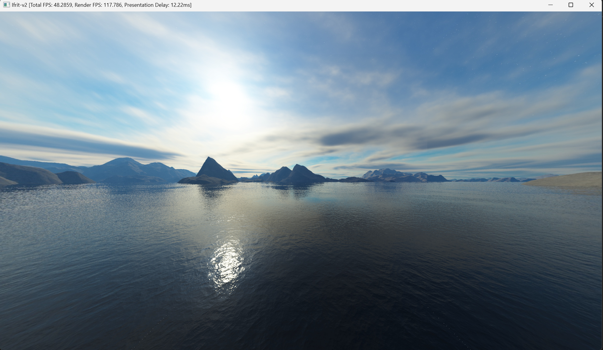
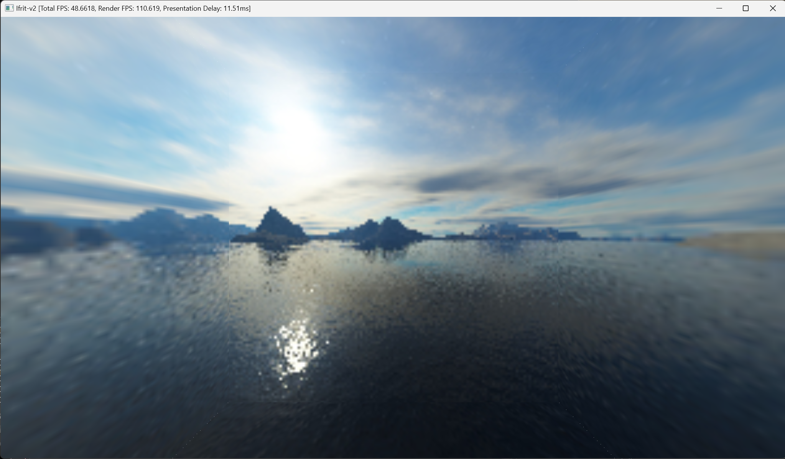
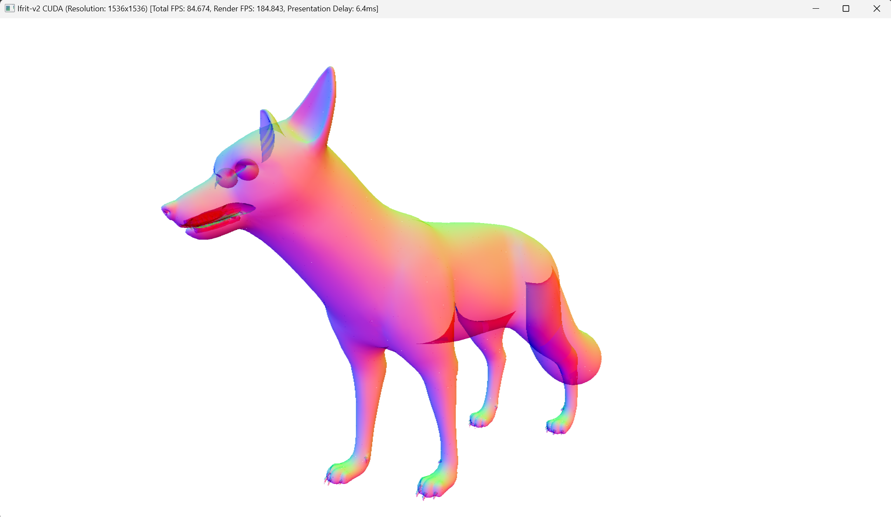
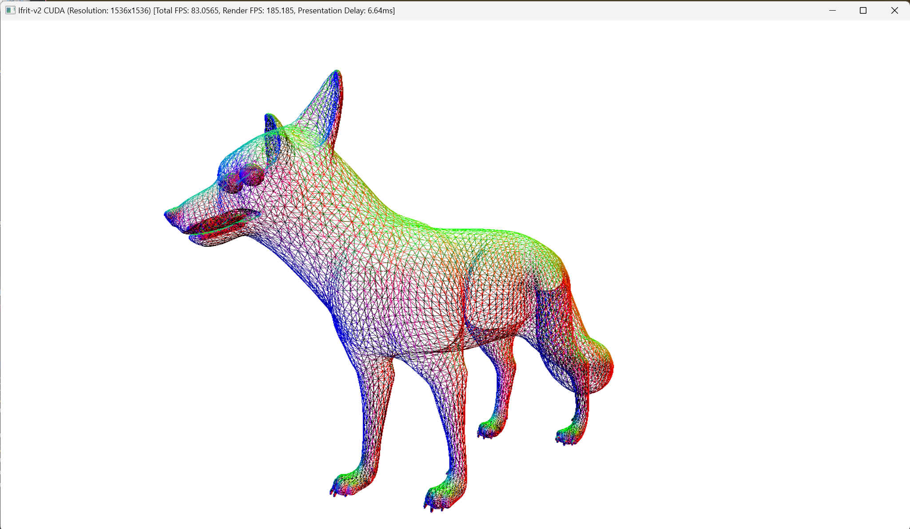
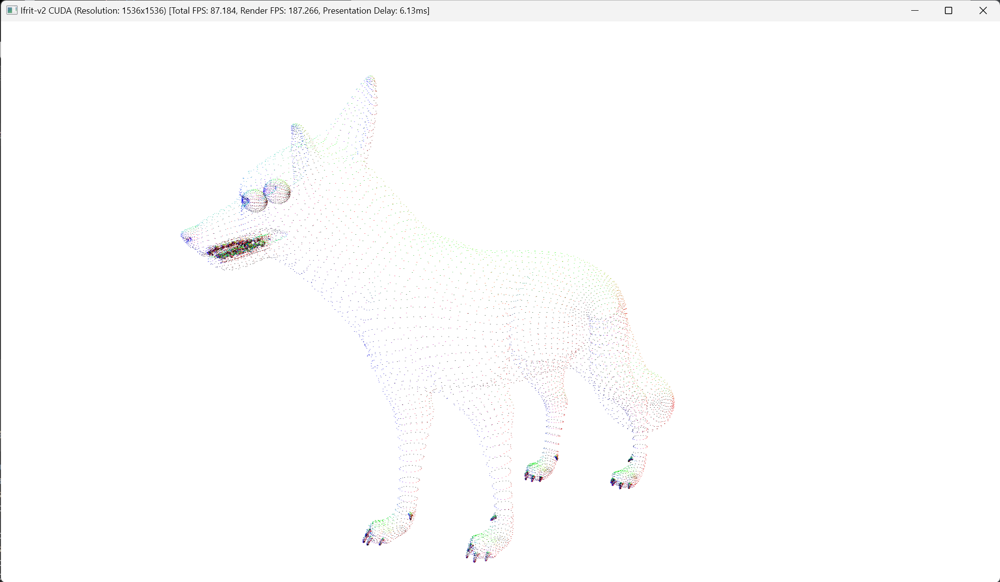
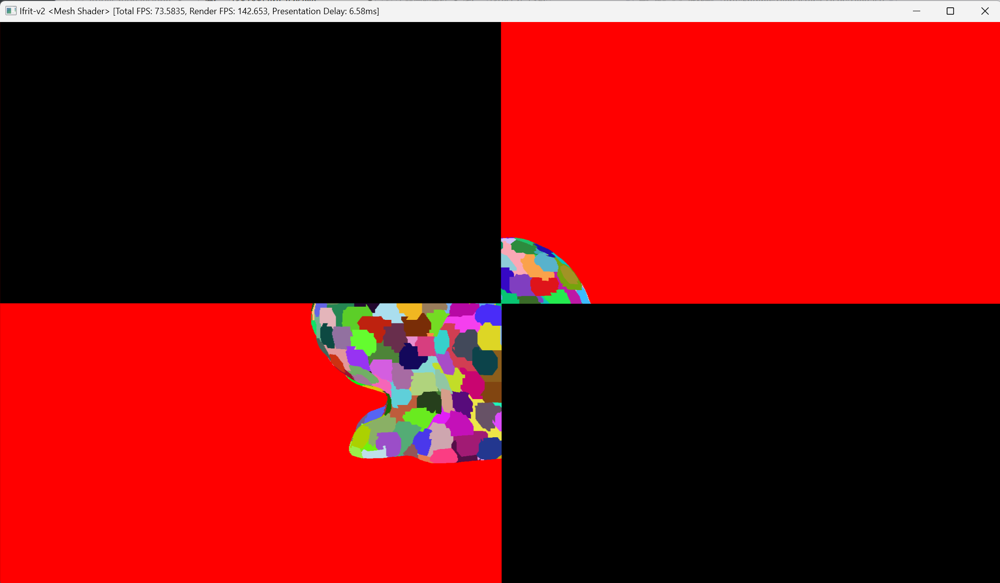
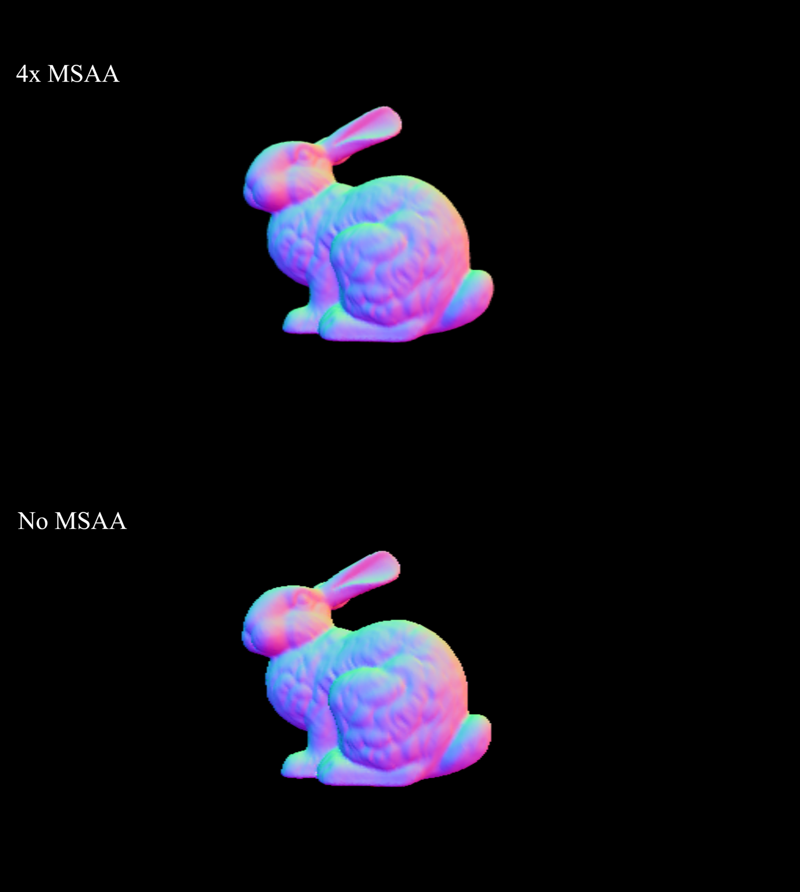
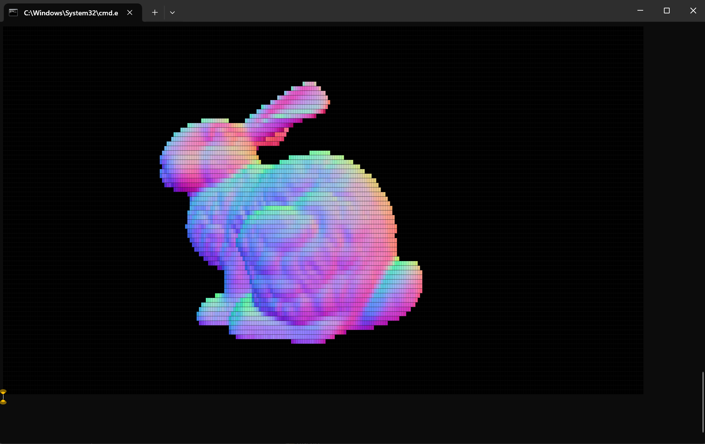
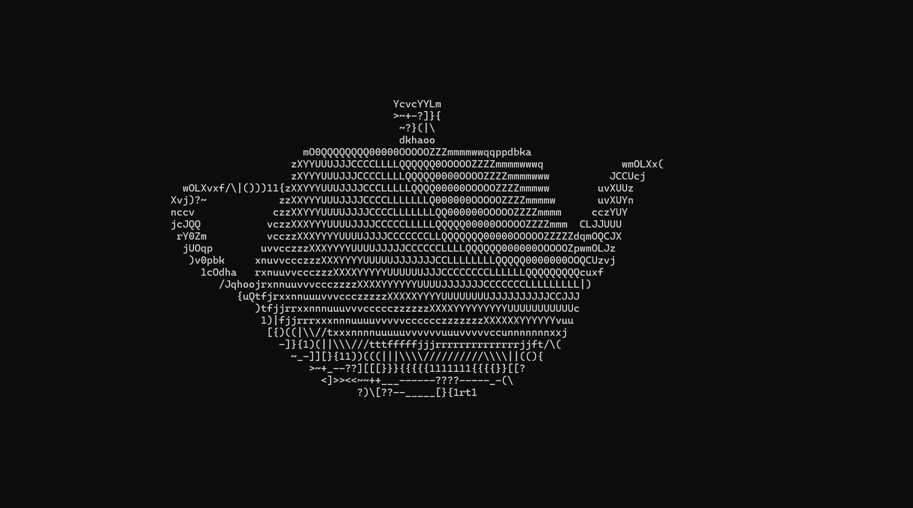

# Ifrit-v2 / Gallery

## Ayanami

### Distance Field Soft Shadow

## Soft Renderer

### Cube Mapping

### Mip-map

### Alpha Blending

### Polygon Modes

#### Wireframe

#### Points

### Scissor Test

### Multi-sampling

### View Layer

#### Colored Terminal Output

#### ASCII Output

