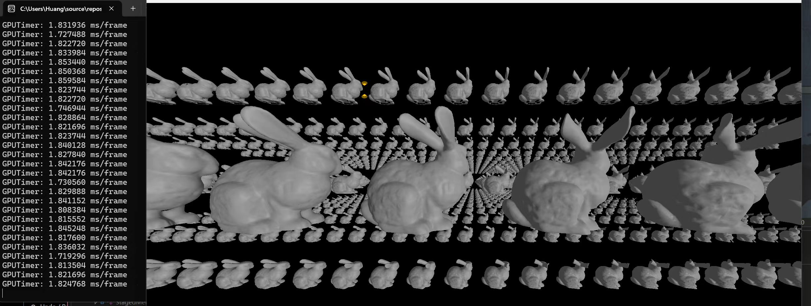
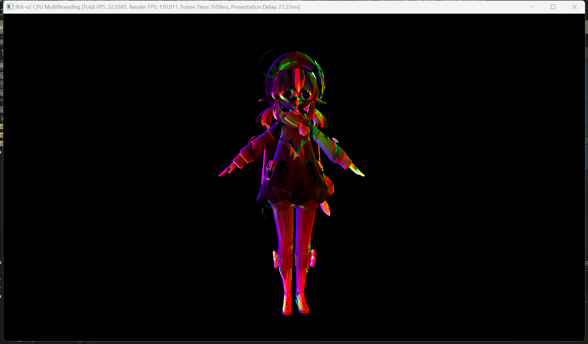
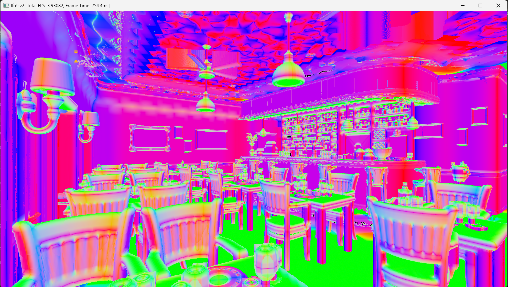
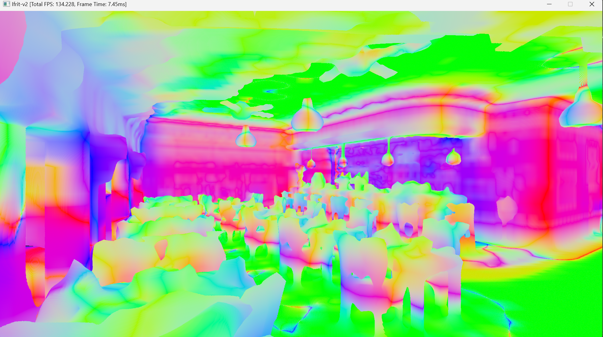
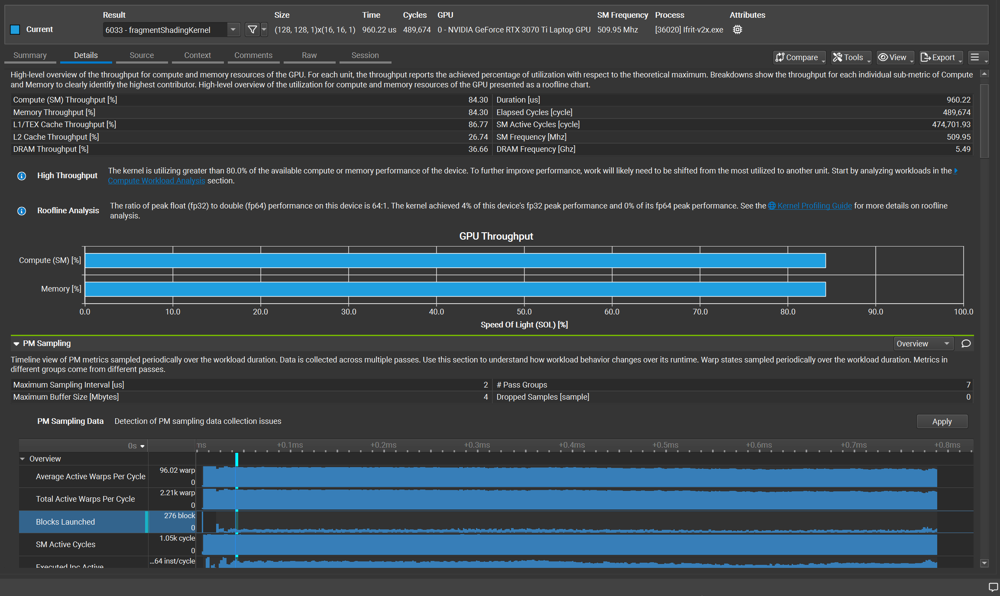
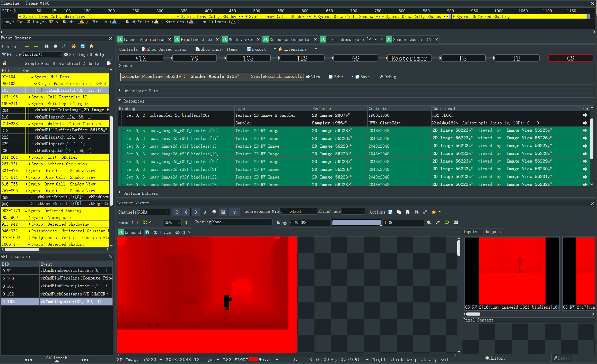

# Ifrit-v2


Some toys about real-time rendering. Currently, it contains:

- **Soft-Renderer**: CUDA / Multithreaded CPU Software Rasterizer & Ray-tracer, with JIT support.
- **Experimental Renderer**:
  - **Syaro**: Deferred Renderer with Nanite-styled Cluster Level of Details. (Under development)
  - **Ayanami**: A planned project for Global Illumination. (Under planning)
    <br/><br/>

- [Ifrit-v2](#ifrit-v2)
  * [1. Features Supported](#1-features-supported)
  * [2. Setup / Run](#2-setup---run)
  * [3. References & Acknowledgements](#3-references---acknowledgements)
  * [4. License](#4-license)


| <center>Soft Renderer / Mesh Shading</center>                | <center>Soft Renderer / CUDA Renderer</center>         |
| ------------------------------------------------------------ | ------------------------------------------------------ |
|                                   |                             |
| <center>**Syaro / Cull Rasterize Visibility Buffer (R32_UINT)**</center> | <center>**Syaro / Final Output**</center>              |
|                              |                           |
| <center>**Syaro / Timing**</center>                          | <center>**Soft Renderer / Derivatives**</center>       |
|   |                              |
| <center>**Ayanami / Mesh Distance Field\***</center>         | <center>**Ayanami / Global Distance Field\***</center> |
|                             |                      |
| <center>**Soft Renderer / Profile** (Nsight Compute)</center> | <center>**Syaro / Debug** (RenderDoc)</center>         |
|                                   |                            |

To visualize Syaro's LoD change, refer to `docs/img/syaro_lod.mkv`

Check  **[`GALLERY.md`](./GALLERY.md)** for more pictures.

<br/><br/>

This repository is the successor to my following repositories: 

- [Aria](https://github.com/Aeroraven/Aria): Some scenes and toys about using WebGL2 and Vulkan.
  - Some features implemented in Aria/Vulkan might be considered to move into this repository, check [here](#4-future-plans) for more details.

- [Ifrit-v1](https://github.com/Aeroraven/Ifrit): An console drawing helper for course projects that use Java.
  - Still, Ifrit-v2 soft renderer supports console display (like Windows Powershell).
- Iris ([C#](https://github.com/Aeroraven/Stargazer/tree/main/ComputerGraphics/TinyRenderer) / [C++](https://github.com/Aeroraven/Stargazer/tree/main/ComputerGraphics/Iris)): Personal replicate for Tiny Renderer.


## 1. Features Supported

### 1.1 Parallelized Soft Renderer

- Parallelized rasterization & ray-tracing pipeline, with GPU (CUDA) & Multithreaded CPU (SIMD) support
- Support mesh shading pipeline (mesh  shaders), and raytracing shaders (like miss shader)
- Support just-in-time compilation of HLSL SPIR-V shader code.
- Covers culling (including contribution culling), MSAA (8x), mipmapping,  anisotropic filtering and shader derivatives (`ddx` & `ddy`)
- Support texture sampling & cube mapping and texture lods.
- For implementation details and performance, check [here](./projects/softgraphics/readme.md)


### 1.2 Experimental Renderer

Refactored version for [my original renderer](https://github.com/Aeroraven/Aria), improving pass management, synchronization primitives and descriptor bindings.

- Bindless Descriptors
- Dynamic Rendering
- Render Hardware Interface
- Render Graph
  - Lock-free Resource Pool & Primary Resource Reuse 
  - Simple Lifetime Tracking & State Tracking
- Task System
- Texture Compression Supports

#### 1.2.1 Syaro: Virtual-Geometry-based Deferred Renderer

- Reproduced some features mentioned in Nanite's report: Two-pass occlusion culling, Mesh LoDs, Compute-shader-based SW rasterization, Simple material classify pass.
- Some extra features supported:

  - Horizon-Based Ambient Occlusion
  - Cascaded Shadow Mapping
  - Temporal Anti-aliasing
  - Convolution Bloom

#### 1.2.2 Ayanami: Maybe Something about Global Illumination

- It's planning to implement some GI algorithms.
- Fully driven by the render graph.
- Currently, it covers:
  - Distance Field Generation*
    - Distance Field Shadow Culling
    - Distance Field Soft Shadow (DFSS)
  - Surface Cache + Radiance Cache


*. For problems and details, refer to [TODO.md](./TODO.md)


## 2. Setup / Run

### 2.1 Clone the Repository

```bash
git clone https://github.com/Aeroraven/Ifrit-v2.git --recursive 
```

### 2.2 Install Dependencies

Following dependencies should be manually configured. Other dependencies will be configured via submodule.

- OpenGL >= 4.6 
- CMake >= 3.24
- MSVC >= 19.29 (`cpp20` Support Required)

**Ifrit Runtime (Syaro/Ayanami)**

- Vulkan SDK 1.3 (with shaderc combined)
  - Core Features 1.3
  - with `EXT_mesh_shader` extension
  - with `EXT_shader_image_atomic_int64` extension

**Ifrit Soft Renderer** 

- LLVM >= 11.0
- CUDA >= 12.5 (Optional)
  - Known compiler issues with CUDA 12.4 with MSVC compiler (fixed in CUDA 12.5)

### 2.3 Quick Start For Syaro Demo

> To run soft renderer demo, checkout another branch.

```shell
cmake -S . -B ./build -DCMAKE_BUILD_TYPE=RelWithDebInfo
cmake --build ./build
```


To run the demo

- Download `lumberyard-bistro` , convert it into `gltf` format with name `untitled.gltf`, then place it in the `project/demo/Asset/Bistro` directory, with dds textures in `textures` subfolder.

```shell
./bin/ifrit.demo.syaro.exe
```


## 3. Architecture

The source files can be decomposed into following parts.

| Module Name        | Functionality                                                |
| ------------------ | ------------------------------------------------------------ |
| ifrit.core         | Basic definitions, logging, serialization, typing utilities (like compilation time utils) |
| ifrit.core.math    | Helper functions for SIMD and performance-oriented intrinsic <br/>Basic linalg supports |
| ifrit.runtime      | Implementations of renderer.<br/>Basic supports for mesh, assets, components and rendering |
| ifrit.demo         | Demo                                                         |
| ifrit.display      | Platform-specific window support <br/>Provides view layer for renderers, like console display for soft renderer |
| ifrit.external     | External dependencies building <br/>Contains FSR2            |
| ifrit.ircompile    | Backend for JIT runtime<br/>Based on LLVM                    |
| ifrit.imaging      | Utilities for image processing<br/>Including some texture compression utilities. |
| ifrit.meshproc     | Algorithms for mesh processing, <br/>Including mesh cluster culling data generation, mesh auto-lod and mesh-level signed distance field generation |
| ifrit.rhi          | Backend-agnostic render hardware interface.                  |
| ifrit.softgraphics | Implementation of soft renderer, with both MT-CPU and CUDA version |
| ifrit.vkgraphics   | Vulkan backend                                               |


## 4. Future Plans
Following features implemented in Aria/Vulkan might be considered to move into this repository:

- Hardware Ray Tracing
- NPR Shading
  - Outline (Post-Processing / Back Facing)
  - Rim Lighting
- Post Processing
  - FXAA
  - Kawase Blur
  - Global Fog
  - SSAO
  - SSGI/SSR
- Volumetric Lighting
- Procedural Generator
  - GPU Marching Cubes

The architecture for subproject Syaro seems to be a little messy, following plans are scheduled:

- Render-Graph-Driven Process
- Redundant Dynamic Uniform Buffer Removal

## 5. References & Acknowledgements

See [ACKNOWLEDGEMENTS.md](./ACKNOWLEDGEMENTS.md) for more details.

Some ideas might be borrowed from Unreal Engine (or its related SIG or GDC presents). However, due to the license compatibility (AGPL-v3 vs. Unreal Engine's EULA), the code is not copied (or used in other predefined forms) from the Unreal Engine source code.


## 6. License

It's by default licensed under [AGPL-v3 License (or later)](https://www.gnu.org/licenses/agpl-3.0.en.html). The copy for license can be found in the root directory. 
