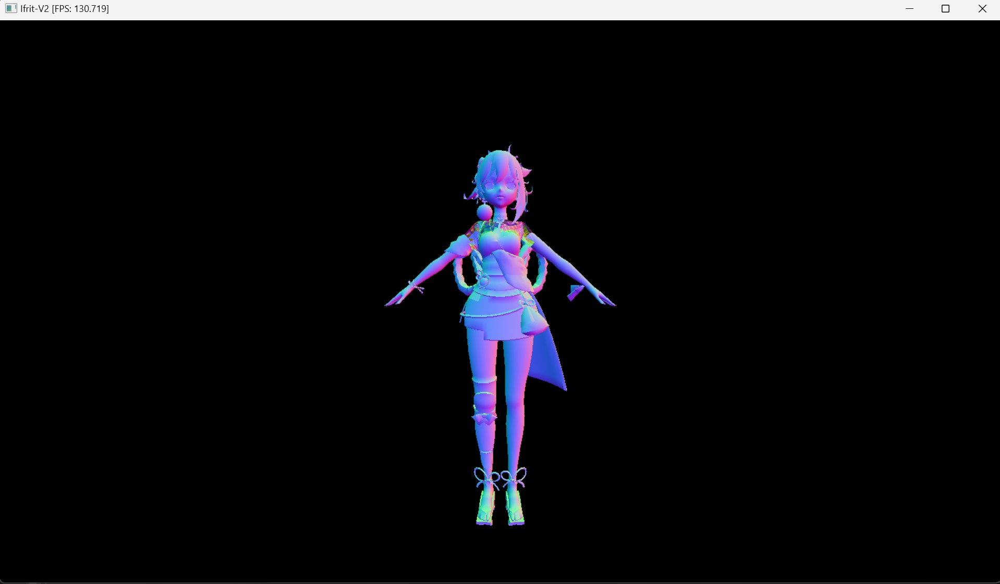

# Ifrit-v2

Software Rasterizer 

Successor to following repos:
 - [Ifrit](https://github.com/Aeroraven/Ifrit)
 - [Iris (TinyRenderer CPP)](https://github.com/Aeroraven/Stargazer/tree/main/ComputerGraphics/Iris)
 - [Iris (TinyRenderer C#)](https://github.com/Aeroraven/Stargazer/tree/main/ComputerGraphics/TinyRenderer)

## Features

- **Performance**:
	- Multithreaded Rasterization
	- SIMD Vectorization

- **Rendering**:
	- Homogeneous Space Clipping

## Dependencies

- Presentation Dependencies:
	- OpenGL 3.3
	- GLFW 3.3
	- GLAD
- Compile Dependencies:
	- CMake 3.28
	- MSVC (Visual Studio 2022)
- Hardware Requirements:
	- SSE4.1
	- AVX2
	- CUDA 12.4 (Planning)

## TODO
- CUDA Integration 