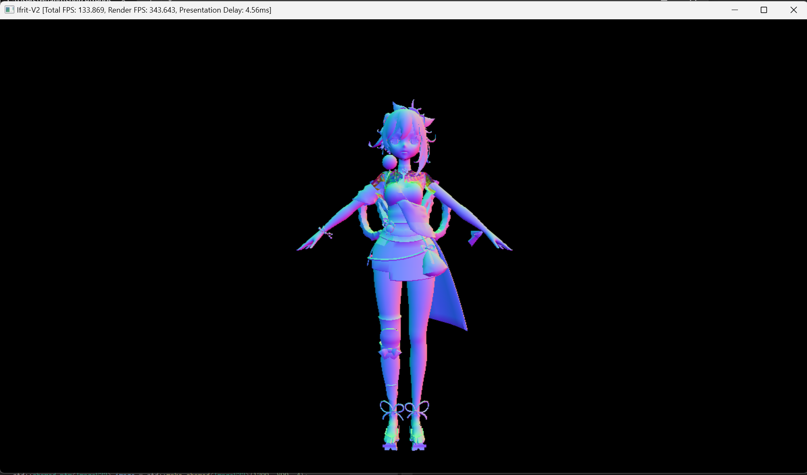
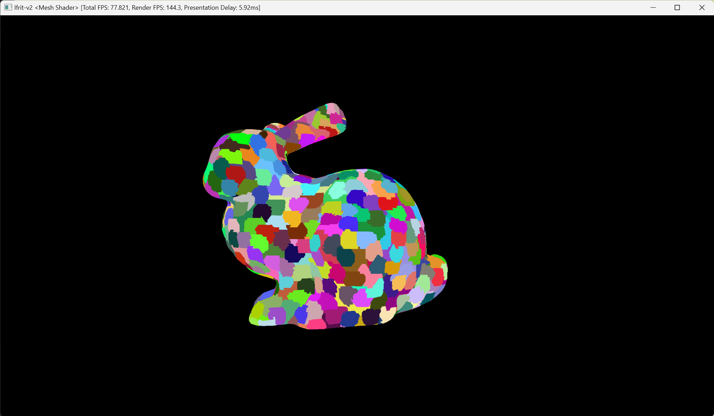

# Ifrit-v2

GPU/CPU-Parallelized tile-based software rasterizer.

Successor to following repos:
 - [Ifrit](https://github.com/Aeroraven/Ifrit)
 - [Iris (TinyRenderer CPP)](https://github.com/Aeroraven/Stargazer/tree/main/ComputerGraphics/Iris)
 - [Iris (TinyRenderer C#)](https://github.com/Aeroraven/Stargazer/tree/main/ComputerGraphics/TinyRenderer)

## Features

- **Performance**:
	- Multithreaded Rasterization
	- SIMD Vectorization
	- CUDA Acceleration (Incomplete)
		- Double Buffering / Overlapped Memory Transfer

- **Rendering**:
	- Homogeneous Space Clipping
	- Programmable VS/FS

- **Presentation**:
	- Terminal Rendering (ASCII Characters/Color Image)

## Dependencies

- Presentation Dependencies:
	- Terminal (Windows Terminal)
	- OpenGL 3.3
	- GLFW 3.3
	- GLAD
- Compile Dependencies:
	- <s>CMake 3.28</s>
	- MSVC (Visual Studio 2022)
		- C++17 is required
		- C++20 is recommended for best performance
	- NVCC
	
- Hardware Requirements:
	- SSE4.1
	- AVX2
	- CUDA 12.4

## Ongoing Plan
- CUDA Integration 
	- Bug: Pixel Artifacts
	- Bug: Access Violation in Homogeneous Clipping