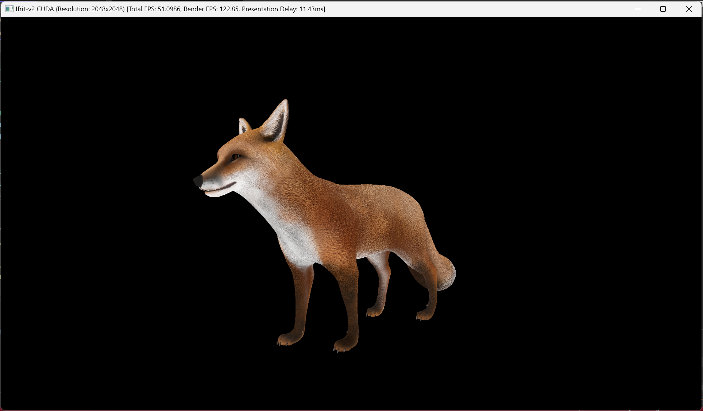
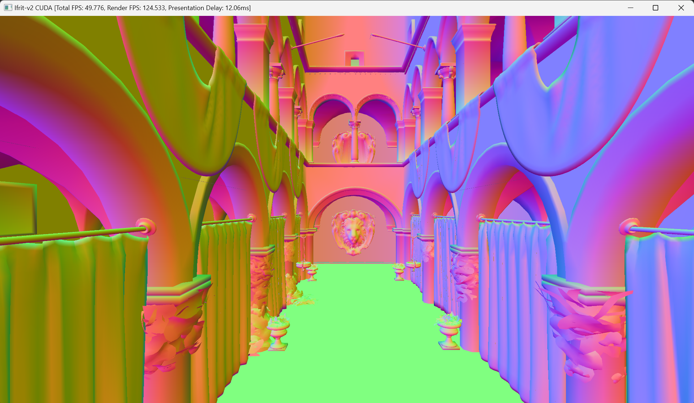
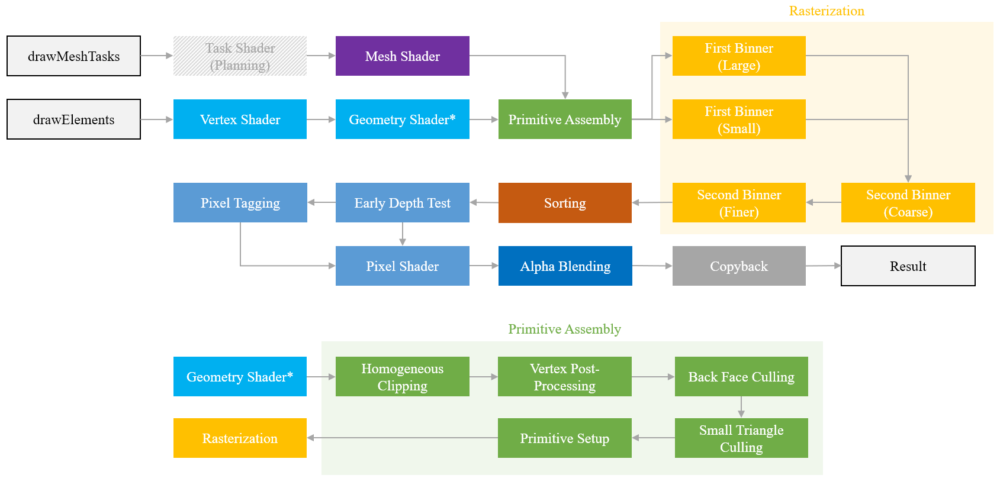

# Ifrit-v2

GPU/CPU-Parallelized tile-based software rasterizer.

Successor to following repos:
 - [Ifrit](https://github.com/Aeroraven/Ifrit)
 - [Iris (TinyRenderer CPP)](https://github.com/Aeroraven/Stargazer/tree/main/ComputerGraphics/Iris)
 - [Iris (TinyRenderer C#)](https://github.com/Aeroraven/Stargazer/tree/main/ComputerGraphics/TinyRenderer)

## Features

Overall framework for CUDA solid triangle renderer pipeline (Some are different from its MT-CPU counterpart). Stages with asterisk mark are optional. Tiling optimization is only applied for filled triangles.

**Note:** This project is NOT an exact replicate of hardware graphics pipeline (like IMR or TBDR architecture). 

| Feature                           | [Iris Renderer](https://github.com/Aeroraven/Stargazer/tree/main/ComputerGraphics/Iris) | MT CPU Renderer | CUDA Renderer |
| --------------------------------- | ------------------------------------------------------------ | --------------- | ------------- |
| **Basic**                         |                                                              |                 |               |
| Rendering Order                   | √                                                            |                 | √ ▲ (4)       |
| **Performance**                   |                                                              |                 |               |
| SIMD Instructions / SIMT          |                                                              | √               | √             |
| Overlapped Memory Transfer        |                                                              |                 | √             |
| Dynamic Tile List                 |                                                              | √               | √ (2)         |
| **Pipeline**                      |                                                              |                 |               |
| Programmable Vertex Shader        | √                                                            | √               | √             |
| Programmable Fragment Shader      | √                                                            | √               | √             |
| Programmable Geometry Shader      |                                                              |                 | √ ▲           |
| Alpha Blending                    |                                                              |                 | √ ▲           |
| Z Pre-Pass                        |                                                              |                 | √             |
| Early-Z Test                      | √                                                            | √               | √             |
| Back Face Culling                 | √                                                            | √               | √             |
| Frustum Culling                   |                                                              | √               | √             |
| Homogeneous Clipping              |                                                              | √ (1)           | √ (1)         |
| Small Triangle Culling            |                                                              |                 | √             |
| Perspective-correct Interpolation |                                                              | √               | √             |
| Shader Derivatives `dFdx` `dFdy`  |                                                              |                 | √ ▲ (3)       |
| **Polygon Mode**                  |                                                              |                 |               |
| Filled Triangle                   | √                                                            | √               | √             |
| Line (Wireframe)                  |                                                              |                 | √ ▲           |
| Point                             |                                                              |                 | √ ▲           |
| **Texture**                       |                                                              |                 |               |
| Basic Support (Sampler)           |                                                              |                 | √             |
| Blit                              |                                                              |                 | √             |
| Mipmap                            |                                                              |                 | √             |
| Filter                            |                                                              |                 | √             |
| Sampler Address Mode              |                                                              |                 | √             |
| **Presentation**                  |                                                              |                 |               |
| Terminal ASCII                    |                                                              | √               | √             |
| Terminal Color                    |                                                              | √               | √             |

(1) For performance consideration, only w-axis is considered 

(2) Device side vector has been replaced with a large fixed-size buffer without tile partition for performance consideration. 

(3) Shader derivatives are now only available for the filled triangle polygon mode. Shader derivatives are calculated in `2x2` quads, so precision might matter.

(4) Only works when `Alpha Blending` is enabled.

▲ Functions with triangle mark are under testing. These functionalities are supported, but might trigger exceptions or introduce performance drops.

### Supported Feature Details

- Sampler Filter :`IF_FILTER_NEAREST`, `IF_FILTER_LINEAR`
- Sampler Address Mode: `IF_SAMPLER_ADDRESS_MODE_REPEAT`, `IF_SAMPLER_ADDRESS_MODE_CLAMP_TO_EDGE`, `IF_SAMPLER_ADDRESS_MODE_CLAMP_TO_BORDER` , `IF_SAMPLER_ADDRESS_MODE_MIRRORED_REPEAT`, `IF_SAMPLER_ADDRESS_MODE_MIRROR_CLAMP_TO_EDGE`

## Performance

Test performed on 2048x2048 RGBA FP32 Image + 2048x2048 FP32 Depth Attachment. Time consumption in presentation stage (displaying texture via OpenGL) is ignored.

Note that some triangles might be culled or clipped in the pipeline. 

All tests were performed before git commit `7e6c34ad836842c02fcc9aa7dc89d5d01cd6cb66`. The result might not be the latest. Note that the introduction of `Shader Derivatives` degenerates the pipeline performance.

**Frame Rate**

| Model          | Triangles | CPU Single Thread* | CPU Multi Threads* | CUDA w/ Copy-back** | CUDA w/o Copy-back*** |
| -------------- | --------- | ------------------ | ------------------ | ------------------- | --------------------- |
| Yomiya         | 70275     | 38 FPS             | 80 FPS             | 123 FPS             | 2857 FPS              |
| Stanford Bunny | 208353    | 20 FPS             | 80 FPS             | 124 FPS             | 2272 FPS              |
| Khronos Sponza | 786801    | 2 FPS              | 10 FPS             | 125 FPS             | 500 FPS               |
| Intel Sponza   | 11241912  | 1 FPS              | 7 FPS              | 125 FPS             | 198 FPS               |

*. Under optimization 

**. Limited by PCIe performance

***. Might be influenced by other applications which utilize GPU

### Test Environment

- CPU: 12th Gen Intel(R) Core(TM) i9-12900H 
  - Test with 16 threads + AVX2 Instructions

- GPU: NVIDIA GeForce RTX 3070 Ti Laptop GPU (Kernel parameters are optimized for the SPECIFIC test environment)
- Shading: World-space normal

## Dependencies

- Hardware Requirements:
  - SSE
  - AVX2
  - CUDA 12.4
- Presentation Dependencies:
	- Terminal (Windows Terminal)
	- OpenGL 3.3
	- GLFW 3.3
	- GLAD
- Compile Dependencies:
	- <s>CMake 3.28</s>
	- MSVC (Visual Studio 2022)
		- C++17 is required
		- C++20 is recommended for best performance
	- NVCC

## Setup

Some dependencies should be prepared before compiling.

- Place `GLAD` dependency in `include\dependency\GLAD\glad\glad.h` and `include\dependency\GLAD\KHR\khrplatform.h`
- Place `sbt_image` in `include\dependency\sbt_image.h`

## Abstractions / Usage

See `docs.md` for more details.

## Ongoing Plan

- Tessellation

- <s>Line Mode</s>

- <s>Texture LOD & Texture Sampler</s>
  
  - <s>Shader Derivatives</s>
  - Anisotropic Filtering
  - Dynamic LOD Selection & Texture Bias
  - Cubic Texture
  - Tiling
  
- Multi-sampling

- <s>Alpha Blending</s>

  - <s>Sorting</s>

- Mesh Shader

- Input Topology

- Triangle Cluster & Cluster LOD

- Known Issues

  - <s>Resolution Change</s>
    - Artifacts in low resolution scenario 
  -  Overdraw: Point mode with index buffer
  -  Latency: Excessive global atomics in line mode

## References

For models / open source code references, check `licenses` folder.

[1]. https://tayfunkayhan.wordpress.com/2019/07/26/chasing-triangles-in-a-tile-based-rasterizer/

[2]. https://www.slideshare.net/slideshow/optimizing-the-graphics-pipeline-with-compute-gdc-2016/59747720

[3]. https://docs.nvidia.com/cuda/cuda-c-programming-guide/
