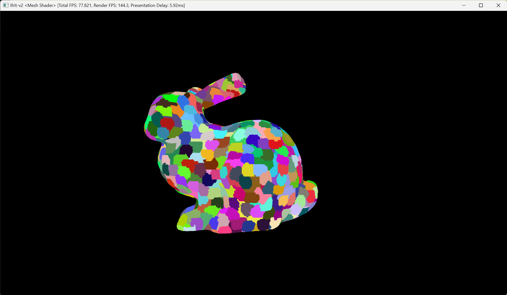
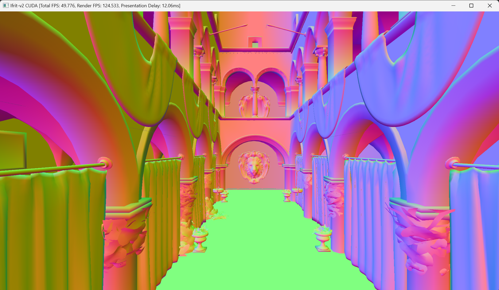

# Ifrit-v2

GPU/CPU-Parallelized tile-based software rasterizer & raytracer.

|  |  |
| --------------------------- | --------------------------- |

Check  **[`gallery.md`](./docs/gallery.md)** for **[More Example Pictures](./docs/gallery.md)**

Successor to following repos: [Ifrit](https://github.com/Aeroraven/Ifrit), [Aria](https://github.com/Aeroraven/Aria) , [Iris (Tiny Renderer CPP)](https://github.com/Aeroraven/Stargazer/tree/main/ComputerGraphics/Iris)  & [Iris (Tiny Renderer C#)](https://github.com/Aeroraven/Stargazer/tree/main/ComputerGraphics/TinyRenderer)


## 1. Structure

The project is organized into following parts.

- **`softrenderer`**: CUDA and CPU multithreaded SIMD software rasterizer & ray-tracer.
  - Covers culling, mesh shading pipeline (mesh shader), MSAA (up to 8x), mipmap, anisotropic filtering, SPIR-V JIT execution and shader derivatives.
  - CPU rasterizer is organized in TBR-like manner, utilize AVX2 instructions and tag buffer (with early-z) for performance gain.
  - For implementation details and performance, check [here](./projects/softgraphics/readme.md)
- **`rhi/vkrenderer`**: Vulkan renderer, intended to be the refactored version for [my original implementation](https://github.com/Aeroraven/Aria).
  - Get rid of messy pass management, synchronization primitives and descriptor bindings in the original repo.

- **`meshproclib`**: Mesh algorithms.
- **`ircompile`**: LLVM JIT compilation for shader codes.
- **`display`**:  Presentation and window surface supporting utilities.


## 2. Setup / Run

> **WARN**: **Compiling files inside `dev` branch might yield UNEXPECTED result.**  Only x86-64 architecture `Windows` and  `Ubuntu` are tested. It mainly covers `Windows` and some `Linux` systems. Other operation systems like `MacOS` are NOT supported.

### 2.1 Clone the Repository

```bash
git clone https://github.com/Aeroraven/Ifrit-v2.git --recursive 
```


### 2.2 Install Dependencies

Following dependencies should be manually configured. Other dependencies will be configured via submodule.

- OpenGL >=3.3
- CMake >=3.24
- Vulkan SDK 1.3, or at least include:
  - Core Features 1.3
  - shaderc combined 1.3
  - with `mesh_shader` extension

- LLVM 10 or LLVM 11 (Maybe higher version is OK, but LLVM 18 or higher might not work properly)


### 2.3 Quick Start 

> **Note:** 
>
> 1. CUDA support is temporarily not included in repo's CMake. 
> 2. Your compiler should support C++20 standards.
>
> **Under Refactoring, Linux GCC compilation MIGHT be unavailable now**

```shell
cmake -S . -B ./build
cmake --build ./build
```

To run the demo

```shell
./bin/ifrit.demo
```


## 3. References & Acknowledgements

This project relies on following open-source projects. Corresponding licenses are in `licenses` folder.

| Repository                                                   | Usage                            | License              |
| ------------------------------------------------------------ | -------------------------------- | -------------------- |
| [stb](https://github.com/nothings/stb)                       | Image Parsing                    | MIT / Unlicensed     |
| [glfw3](https://github.com/glfw/glfw)                        | Window and Display support       | Zlib                 |
| [spirv-headers](https://github.com/KhronosGroup/SPIRV-Headers/) | SPIR-V Standard Reference        | MIT                  |
| [glad](https://github.com/Dav1dde/glad/)                     | OpenGL Header Generation.        | Generated files used |
| [llvm-project](https://github.com/llvm/llvm-project)         | JIT Runtime                      | Apache 2.0           |
| [meshoptimizer](https://github.com/zeux/meshoptimizer)       | Mesh Algorithm                   | MIT                  |
| [METIS](https://github.com/KarypisLab/METIS/)                | Mesh Algorithm / Graph Partition | Apache 2.0           |
| [Vulkan Memory Allocator](https://github.com/GPUOpen-LibrariesAndSDKs/VulkanMemoryAllocator) | Memory Allocation                | MIT                  |
| [cereal](https://github.com/USCiLab/cereal)                  | Serialization                    | BSD-3                |
| [tinygltf](https://github.com/syoyo/tinygltf/tree/release)   | Model Loading                    | MIT                  |
| [stduuid](https://github.com/mariusbancila/stduuid)          | UUID                             | MIT                  |
| spirv-reflect                                                | Shader Reflection                | Apache 2.0           |


And for debugging

- [RenderDoc](https://renderdoc.org/), for debugging and inspecting.


And some references that give inspirations. Thanks for their selfless dedications.

**Software Rasterization**：

1. https://tayfunkayhan.wordpress.com/2019/07/26/chasing-triangles-in-a-tile-based-rasterizer/
   1. https://github.com/NotCamelCase/Tyler
2. https://www.slideshare.net/slideshow/optimizing-the-graphics-pipeline-with-compute-gdc-2016/59747720
3. https://docs.nvidia.com/cuda/cuda-c-programming-guide/
4. https://llvm.org/docs/LangRef.html
5. https://www.mesa3d.org/
6. https://agner.org/optimize/

**Modern Graphics Pipeline**

1. https://advances.realtimerendering.com/s2021/Karis_Nanite_SIGGRAPH_Advances_2021_final.pdf
2. https://qiutang98.github.io/post/%E5%AE%9E%E6%97%B6%E6%B8%B2%E6%9F%93%E5%BC%80%E5%8F%91/mynanite01_mesh_processor/
   1. https://github.com/qiutang98/chord/tree/master
3. https://jglrxavpok.github.io/2024/01/19/recreating-nanite-lod-generation.html
4. https://lesleylai.info/en/vk-khr-dynamic-rendering/
5. https://vulkan-tutorial.com/
6. https://poniesandlight.co.uk/reflect/island_rendergraph_1/
   1. https://github.com/tgfrerer/island
7. https://dev.to/gasim/implementing-bindless-design-in-vulkan-34no
8. https://github.com/KhronosGroup/Vulkan-Samples


