# Ifrit-v2

A collection of personal real-time rendering and simulation experiments.

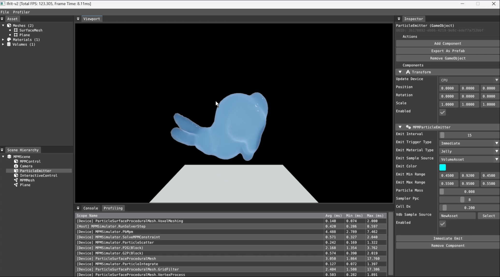

Subprojects covered: 

- **Software Renderer**: CUDA/Multithreaded CPU rasterizer & ray-tracer with JIT compilation

- **Experimental Rendererer**: 
  
  - **Syaro**: Deferred renderer with Nanite-inspired cluster-based level of detail
  - **Ayanami**: Global illumination using probes and software ray tracing
  - **Artemis**: GPU-accelerated physical simulation algorithms
  
  


| Soft Renderer / Mesh Shading                                | Soft Renderer / CUDA Renderer                                |
| ----------------------------------------------------------- | ------------------------------------------------------------ |
| 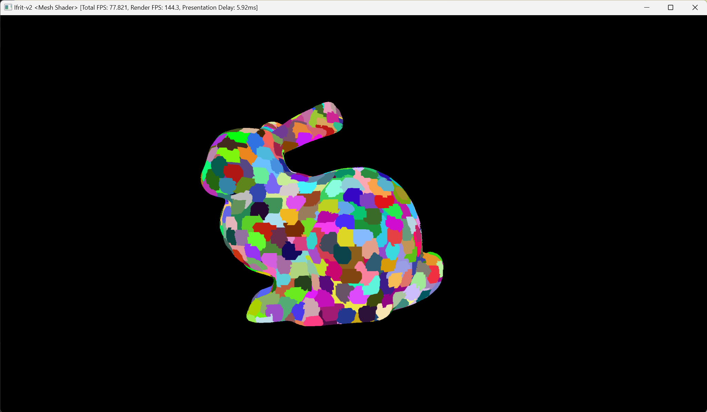                                 | 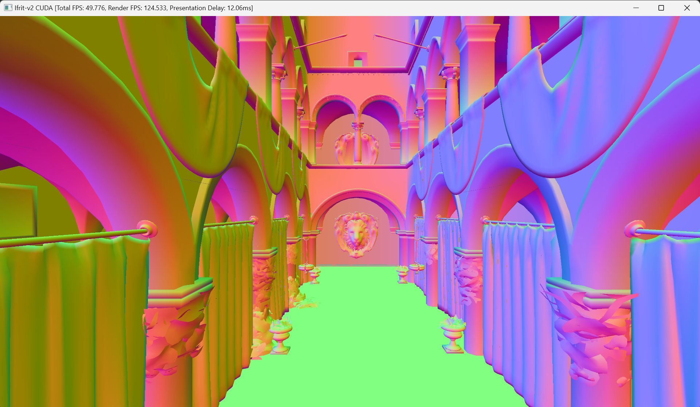                                  |
| **Syaro / Cull Rasterize Visibility Buffer (R32_UINT)**     | **Syaro / Final Output**                                     |
| 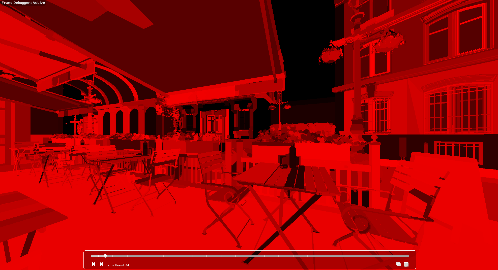                            | 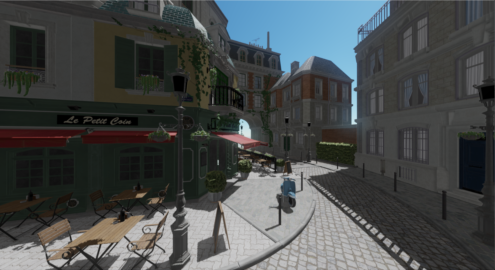                                |
| **Syaro / Timing**                                          | **Soft Renderer / Derivatives**                              |
| 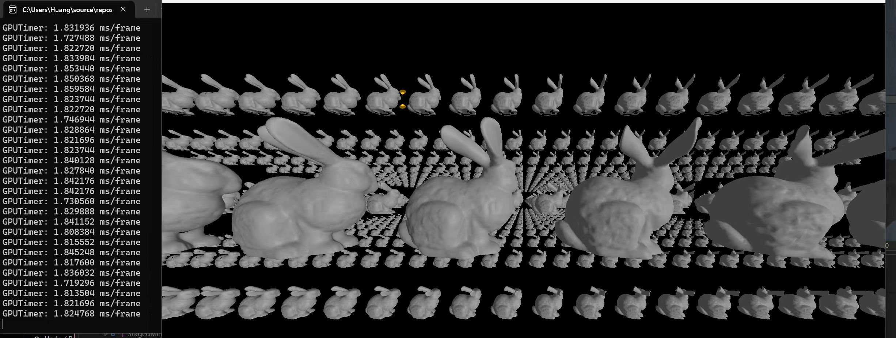 | 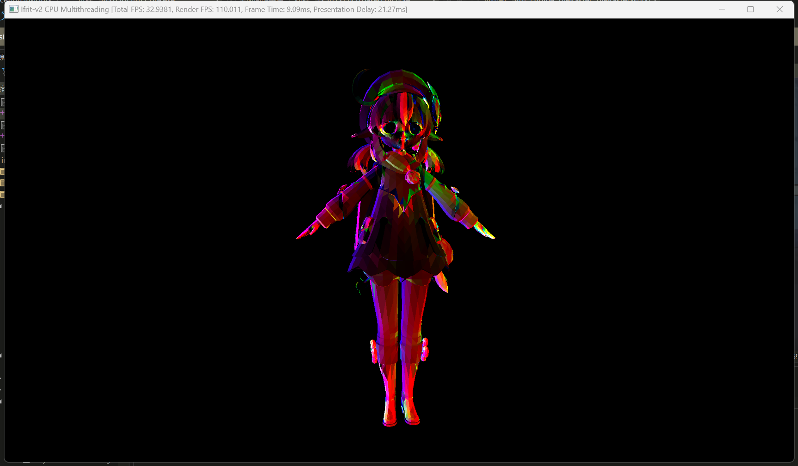                                   |
| **Ayanami / GDF Object Grids + Surface Cache Lookup***      | **Ayanami / Global Distance Field (GDF)\***                  |
| 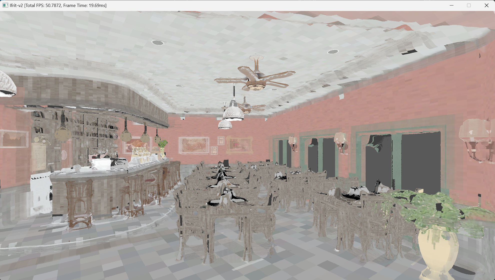                      | 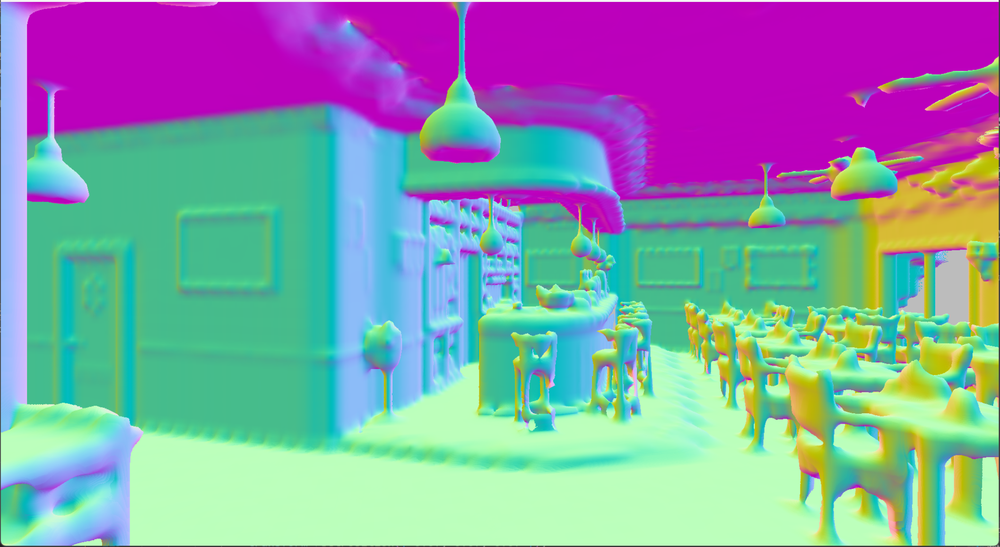                          |
| **Artemis / Position Based Dynamics**                       | **Artemis / PBMPM 2D**                                       |
| 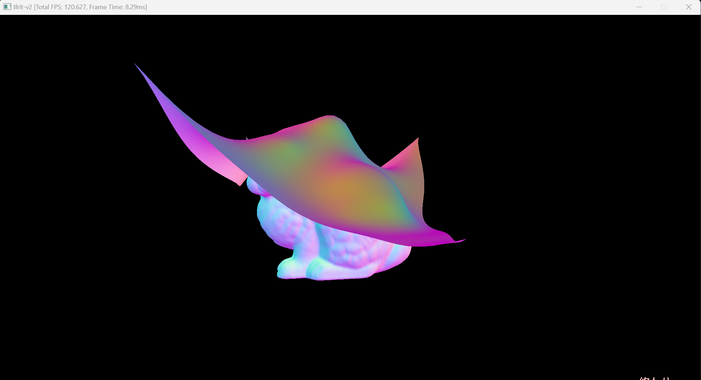                              | 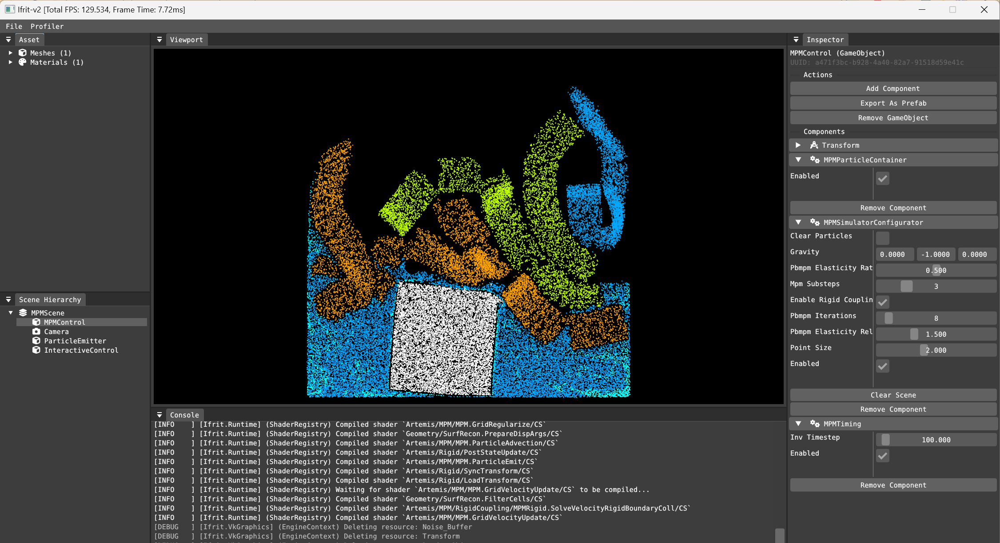  |
| **Soft Renderer / Profile** (Nsight Compute)                | **Ayanami / Debug (Hierarchical Tracing, Incomplete) \*** (RenderDoc) |
| 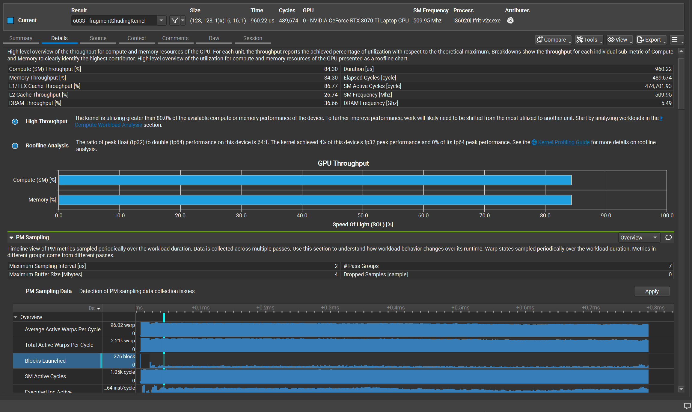      | 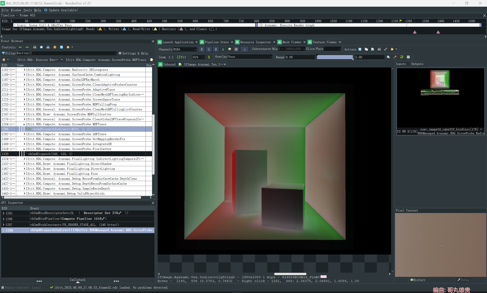       |

**📸 See [`GALLERY.md`](./GALLERY.md) for more screenshots**  
**🎥 View Syaro's LoD transitions: `docs/img/syaro_lod.mkv`**   
**🎥 View Artemis's 3D MPM Demo: `docs/img/artemis_pbmpm4.mp4`**

---

## About This Project

This repository succeeds my previous rendering projects:
- **[Aria](https://github.com/Aeroraven/Aria)**: WebGL2 and Vulkan experiments
- **[Ifrit-v1](https://github.com/Aeroraven/Ifrit)**: Java-based console renderer
- **Iris** ([C#](https://github.com/Aeroraven/Stargazer/tree/main/ComputerGraphics/TinyRenderer) / [C++](https://github.com/Aeroraven/Stargazer/tree/main/ComputerGraphics/Iris)): Tiny Renderer implementation


## ✨Features Supported

### Parallelized Soft Renderer

- Parallelized rasterization & ray-tracing pipeline, with GPU (CUDA) & Multithreaded CPU (SIMD) support
- Support mesh shading pipeline (mesh  shaders), and raytracing shaders (like miss shader)
- Support just-in-time compilation of HLSL SPIR-V shader code.
- Covers culling (including contribution culling), MSAA (8x), mipmapping,  anisotropic filtering and shader derivatives (`ddx` & `ddy`)
- Support texture sampling & cube mapping and texture lods.
- For implementation details and performance, check [here](./modules/softgraphics/readme.md)


### Experimental Renderer

Refactored version for [my original renderer](https://github.com/Aeroraven/Aria), improving pass management, synchronization primitives and descriptor bindings.

- Render Hardware Interface (RHI)
- Render Dependency Graph (RDG)
- Modern Graphics API Features: Bindless Descriptors, Dynamic Rendering ...
- Miscellaneous Utilities: Simple Editor*, Task System, Shader Variants, Texture Compression Supports ...
- Reflection & Serialization Support: 
  - Able to be non-intrusive**. No `GENERATED_BODY` and `CLASS(classname)` like macros. 
  - User-friendly. Use `IF_PROPERTY(Editable,...)` `IF_FUNCTION()` to mark stuffs to register.


#### Subproject Syaro

- Reproduced some features mentioned in Nanite's report: Two-pass occlusion culling, Mesh LoDs, Compute-shader-based SW rasterization, Simple material classify pass.
- Some extra features supported: Horizon-Based Ambient Occlusion (HBAO) / Cascaded Shadow Mapping (CSM) / Temporal Anti-aliasing (TAA) / Convolution Bloom


#### Subproject Ayanami*

- Distance Field Generation: Distance Field Shadow Culling / Distance Field Soft Shadow (DFSS) /BC4 Compression
- Surface Cache: Object Grids (Global Distance Field Attribute Lookup)
- Lighting Probes: Adaptive Screen Space Probe Placement / Screen  Probe Tracing 
  - Screen Space Tracing (SSGI+HiZ)
  - Mesh/Global Distance Field Tracing (Grid Cull+Ray Marching)
  

#### Subproject Artemis

- Position Based Dynamics (PBD) : SDF Collision Constraints / Volume Constraints / XPBD
- Material Point Method (MPM):  MLS-MPM (2D/3D), PB-MPM (2D/3D), Two-way Rigid Coupling
- Procedural Surface Reconstruction


<small>*. Ayanami is still an incomplete project for I am working on projects with higher priority. These features might be severely unstable and time-consuming. For problems and details, refer to [CHANGELOG.md](./CHANGELOG.md)  [TODO.md](./TODO.md)</small>

<small>**. This C++ reflection system supports both non-intrusive (manual, external registration) and intrusive (macro-based, codegen-assisted) reflection. The macro-based approach is technically intrusive, since the user has to modify the class definition, even though the macro is empty at compile time. It’s only used by tooling to generate registration code.</small>

## ⚡️Quick Start

> Some breaking changes (like changes in serialization and asset management) were made in `dev` branch recently (Refer to  [TODO.md](./TODO.md) for more details). Former serialization library has been replaced by a new embedded reflection system, and the compatibility patches for older codes are not fully covered now.
>
> **It's required to switch to branch `checkpoint/v4` to run `Syaro/Ayanami Demo`, and `checkpoint/v1` to run `Software Renderer`.** 

### 1. Clone Repository
```bash
git clone https://github.com/Aeroraven/Ifrit-v2.git --recursive 
```


### 2. Install Dependencies

- CMake 3.25+

- MSVC 19.29+

- Python 3

- libclang 19 

- Vulkan SDK 1.3.296+

  - Core 1.2 features (required)

  - `EXT_mesh_shader` extension (optional¹)

  - `EXT_shader_atomic_float` extension (optional¹)

  
  > ¹ **Device Compatibility:**
  >
  > | Subproject | RTX 3070 Ti | GTX 1050           |
  > | ---------- | ----------- | ------------------ |
  > | Syaro      | ✅           | ❌ (No mesh shader) |
  > | Ayanami    | ✅           | ❌ (No mesh shader) |
  > | Artemis    | ✅           | ✅                  |

**3. Build**

```bash
bash Setup.sh --clang-root /path/to/clang
```


## 🧱Architecture

The source files can be decomposed into following parts.

| Module Name         | Functionality                                                |
| ------------------- | ------------------------------------------------------------ |
| ifrit.core          | Basic definitions, logging, dynamic reflection and serialization, typing utilities (like compilation time utils)<br/>(Dependency: `spdlog`) |
| ifrit.core.math     | Helper functions for SIMD and performance-oriented intrinsic <br/>Basic linalg supports |
| ifrit.demo          | Demo                                                         |
| ifrit.display       | Platform-specific window support <br/>Provides view layer for renderers, like console display for soft renderer<br/>(Dependency: `glfw3`) |
| ifrit.editor        | Editor subsystem and debugging components for runtime<br/>Debug purpose only<br/>(Dependency: `imgui`) |
| ifrit.external      | External dependencies building <br/>(Dependency: `fsr2`)     |
| ifrit.geomproc      | Algorithms for geometry processing, and CPU acceleration structures<br/>Including mesh cluster culling data generation, mesh tetrahedralization, mesh auto-lod and mesh-level signed distance field generation<br/>(Dependency: `metis`,`meshoptimizer`,`openvdb`,`tetgen`) |
| ifrit.ircompile     | Backend for JIT runtime<br/>(Dependency: `llvm`)             |
| ifrit.imaging       | Utilities for image processing<br/>Including some texture compression utilities.<br/>(Dependency: `ktx`) |
| ifrit.profiler      | Debugging Utilities<br/>(Dependency: `renderdoc`)            |
| ifrit.reflparser    | Tool for code parsing for `ifrit.core/reflection` utilities.<br/>(Dependency: `llvm/libclang`) |
| ifrit.rhi           | Backend-agnostic render hardware interface.                  |
| ifrit.runtime       | Implementations of renderer.<br/>Basic supports for mesh, assets, components and rendering |
| ifrit.shadercompile | Backend for shader compilation<br/>Contains glslc and slang backend<br/>(Dependency: `glslc`,`slang`) |
| ifrit.softgraphics  | Implementation of soft renderer, with both MT-CPU and CUDA version<br/>(Dependency: `cuda`) |
| ifrit.vkgraphics    | Vulkan backend<br/>(Dependency: `vulkan`)                    |

## 📌Future Plans

See [TODO.md](./TODO.md) for more details.


## 📌References & Acknowledgements

See [ACKNOWLEDGEMENTS.md](./ACKNOWLEDGEMENTS.md) for more details.

This project draws inspiration from modern rendering techniques and research papers. While influenced by industry presentations (including Unreal Engine's technical talks), all code is original implementation to maintain license compatibility.

Special thanks to interviewers and mentors who provided valuable feedback during my internship applications—many suggestions have been incorporated into the roadmap.

## 📌License

**[AGPL-v3 License (or later)](https://www.gnu.org/licenses/agpl-3.0.en.html)**

This repository includes external dependencies under AGPL-3.0. Dual licensing available with contributor consent.

