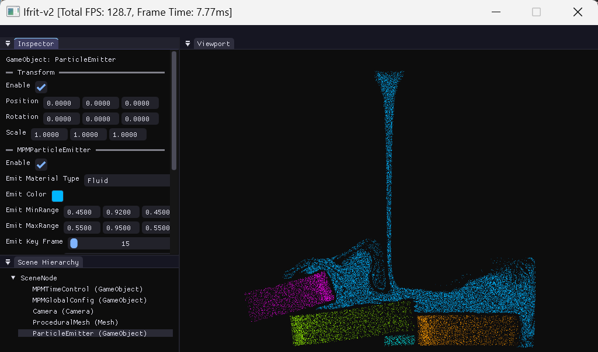
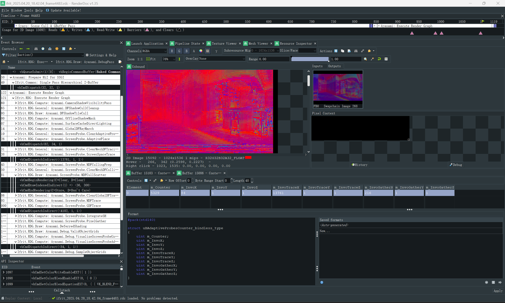

# Ifrit-v2


Some **TOYS** about real-time rendering/simulation. Currently, it contains:

- **Soft-Renderer**: CUDA / Multithreaded CPU Software Rasterizer & Ray-tracer, with JIT support.
- **Experimental Renderer**: All projects are still under development.
  - **Syaro**: Deferred Renderer with Nanite-styled Cluster Level of Details. 
  - **Ayanami**: A Planned Project for Global Illumination with Probes and Software Raytracing.
  - **Artemis**: GPU-Accelerated Basic Algorithms For Physical Simulation


| Soft Renderer / Mesh Shading                                | Soft Renderer / CUDA Renderer                                |
| ----------------------------------------------------------- | ------------------------------------------------------------ |
|                                  |                                   |
| **Syaro / Cull Rasterize Visibility Buffer (R32_UINT)**     | **Syaro / Final Output**                                     |
|                             |                                 |
| **Syaro / Timing**                                          | **Soft Renderer / Derivatives**                              |
|  |                                    |
| **Ayanami / GDF Object Grids + Surface Cache Lookup***      | **Ayanami / Global Distance Field (GDF)\***                  |
|                       |                           |
| **Artemis / Position Based Dynamics**                       | **Artemis / PBMPM + Property Editing**                       |
|                               |    |
| **Soft Renderer / Profile** (Nsight Compute)                | **Ayanami / Debug (Tracing Hierarchy, Incomplete) \*** (RenderDoc) |
|       |         |

**Check  [`GALLERY.md`](./GALLERY.md) for more pictures.**

To visualize Syaro's LoD change, refer to `docs/img/syaro_lod.mkv`

<br/>

This repository is the successor to my following repositories: 

- [Aria](https://github.com/Aeroraven/Aria): Some scenes and toys about using WebGL2 and Vulkan.

- [Ifrit-v1](https://github.com/Aeroraven/Ifrit): An console drawing helper for course projects that use Java.
  - Still, Ifrit-v2 soft renderer supports console display (like Windows Powershell).
- Iris ([C#](https://github.com/Aeroraven/Stargazer/tree/main/ComputerGraphics/TinyRenderer) / [C++](https://github.com/Aeroraven/Stargazer/tree/main/ComputerGraphics/Iris)): Personal replicate for Tiny Renderer.


## 1. Features Supported

### 1.1 Parallelized Soft Renderer

- Parallelized rasterization & ray-tracing pipeline, with GPU (CUDA) & Multithreaded CPU (SIMD) support
- Support mesh shading pipeline (mesh  shaders), and raytracing shaders (like miss shader)
- Support just-in-time compilation of HLSL SPIR-V shader code.
- Covers culling (including contribution culling), MSAA (8x), mipmapping,  anisotropic filtering and shader derivatives (`ddx` & `ddy`)
- Support texture sampling & cube mapping and texture lods.
- For implementation details and performance, check [here](./projects/softgraphics/readme.md)


### 1.2 Experimental Renderer

Refactored version for [my original renderer](https://github.com/Aeroraven/Aria), improving pass management, synchronization primitives and descriptor bindings.

- Render Hardware Interface (RHI)
- Render Dependency Graph (RDG)
- Modern Graphics API Features: Bindless Descriptors, Dynamic Rendering ...
- Miscellaneous Utilities: Simple Editor*, Task System, Shader Variants, Texture Compression Supports ...

#### 1.2.1 Subproject Syaro

- Reproduced some features mentioned in Nanite's report: Two-pass occlusion culling, Mesh LoDs, Compute-shader-based SW rasterization, Simple material classify pass.
- Some extra features supported: Horizon-Based Ambient Occlusion (HBAO) / Cascaded Shadow Mapping (CSM) / Temporal Anti-aliasing (TAA) / Convolution Bloom


#### 1.2.2 Subproject Ayanami*

- Distance Field Generation: Distance Field Shadow Culling / Distance Field Soft Shadow (DFSS) /BC4 Compression
- Surface Cache: Object Grids (Global Distance Field Attribute Lookup)
- Lighting Probes: Adaptive Screen Space Probe Placement / Screen  Probe Tracing 
  - Screen Space Tracing (SSGI+HiZ)
  - Mesh/Global Distance Field Tracing (Grid Cull+Ray Marching)
  

#### 1.2.3 Subproject Artemis

- Position Based Dynamics (PBD) : SDF Collision Constraints / Volume Constraints / XPBD
- Material Point Method (MPM):  MLS-MPM (2D/3D), PB-MPM (2D/3D)


*. These features might be severely unstable and time-consuming. For problems and details, refer to [CHANGELOG.md](./CHANGELOG.md)


## 2. Setup / Run

### 2.1 Clone the Repository

```bash
git clone https://github.com/Aeroraven/Ifrit-v2.git --recursive 
```

### 2.2 Install Dependencies

Following dependencies should be manually configured. Other dependencies will be configured via submodule.

- OpenGL >= 4.6 
- CMake >= 3.25
- MSVC >= 19.29
- Python 3

Before going on, following script should be executed to ensure that dependencies are installed. Currently, this script ensures prerequisites for some dependencies (`openvdb` now)

```shell
bash InstallPrerequisite.sh # Use Cygwin/MinGW/Git Bash for Windows
```


**Ifrit Runtime (Subprojects Syaro/Ayanami/Artemis)**

- Vulkan SDK >= 1.3.296
  - Core Features 1.2 (Necessary)
  - with `EXT_mesh_shader` extension (Optional^)
  - with `EXT_shader_atomic_float` extension (Optional^)

> ^. You can still use partial of the `Ifrit.Runtime` features without some extensions. That means you can use the core features to create a new project. However, three subprojects will not work properly without these extensions. Your app might crash or fail to run. Following devices are tested. 
>
> | Subprojects | NVIDIA RTX 3070 Ti | NVIDIA GTX 1050            |
> | ----------- | ------------------ | -------------------------- |
> | Syaro       | √                  | × (No mesh shader support) |
> | Ayanami     | √                  | × (No mesh shader support) |
> | Artemis        | √                  | √                          |

**Ifrit Soft Renderer** 

- LLVM >= 11.0
- CUDA >= 12.5 (Optional)
  - Known compiler issues with CUDA 12.4 with MSVC compiler (fixed in CUDA 12.5)

### 2.3  Compile And Run

> To run soft renderer demo, checkout another branch.

```shell
cmake -S . -B ./build 
cmake --build ./build --config RelWithDebInfo # Or open Visual Studio manually
```

To run the demo

- Download `lumberyard-bistro` , convert it into `gltf` format with name `untitled.gltf`, then place it in the `project/demo/Asset/Bistro` directory, with dds textures in `textures` subfolder.

```shell
./bin/ifrit.demo.syaro.exe
```


## 3. Architecture

The source files can be decomposed into following parts.

| Module Name         | Functionality                                                |
| ------------------- | ------------------------------------------------------------ |
| ifrit.core          | Basic definitions, logging, serialization, typing utilities (like compilation time utils)<br/>(Dependency: `spdlog`) |
| ifrit.core.math     | Helper functions for SIMD and performance-oriented intrinsic <br/>Basic linalg supports |
| ifrit.runtime       | Implementations of renderer.<br/>Basic supports for mesh, assets, components and rendering |
| ifrit.demo          | Demo                                                         |
| ifrit.display       | Platform-specific window support <br/>Provides view layer for renderers, like console display for soft renderer<br/>(Dependency: `glfw3`) |
| ifrit.external      | External dependencies building <br/>(Dependency: `fsr2`)     |
| ifrit.ircompile     | Backend for JIT runtime<br/>(Dependency: `llvm`)             |
| ifrit.imaging       | Utilities for image processing<br/>Including some texture compression utilities.<br/>(Dependency: `ktx`) |
| ifrit.geomproc      | Algorithms for geometry processing, and CPU acceleration structures<br/>Including mesh cluster culling data generation, mesh tetrahedralization, mesh auto-lod and mesh-level signed distance field generation<br/>(Dependency: `metis`,`meshoptimizer`,`openvdb`,`tetgen`) |
| ifrit.rhi           | Backend-agnostic render hardware interface.                  |
| ifrit.ui            | UI subsystem and debugging components for runtime<br/>Debug purpose only<br/>(Dependency: `imgui`) |
| ifrit.shadercompile | Backend for shader compilation<br/>Contains glslc and slang backend<br/>(Dependency: `glslc`,`slang`) |
| ifrit.softgraphics  | Implementation of soft renderer, with both MT-CPU and CUDA version<br/>(Dependency: `cuda`) |
| ifrit.vkgraphics    | Vulkan backend<br/>(Dependency: `vulkan`)                    |

## 4. Future Plans

See [TODO.md](./TODO.md) for more details.


## 5. References & Acknowledgements

See [ACKNOWLEDGEMENTS.md](./ACKNOWLEDGEMENTS.md) for more details.

Some ideas might be borrowed from Unreal Engine (or its related SIG or GDC presents). However, due to the license compatibility (AGPL-v3 vs. Unreal Engine's EULA), the code is not copied (or used in other predefined unallowed forms) from the Unreal Engine source code.

And extra acknowledgements to the comments from interviewers and the mentor(s) when I was seeking for my summer internship opportunities. Some suggestions were added into the todo list.

## 6. License

Note that this repository contains external dependencies that use AGPL3.0 license.

The repo is licensed under [AGPL-v3 License (or later)](https://www.gnu.org/licenses/agpl-3.0.en.html) **by default**. Other licenses are only applicable with all contributors' consent. Dual licensing is applicable. The copy for license can be found in the root directory. 


