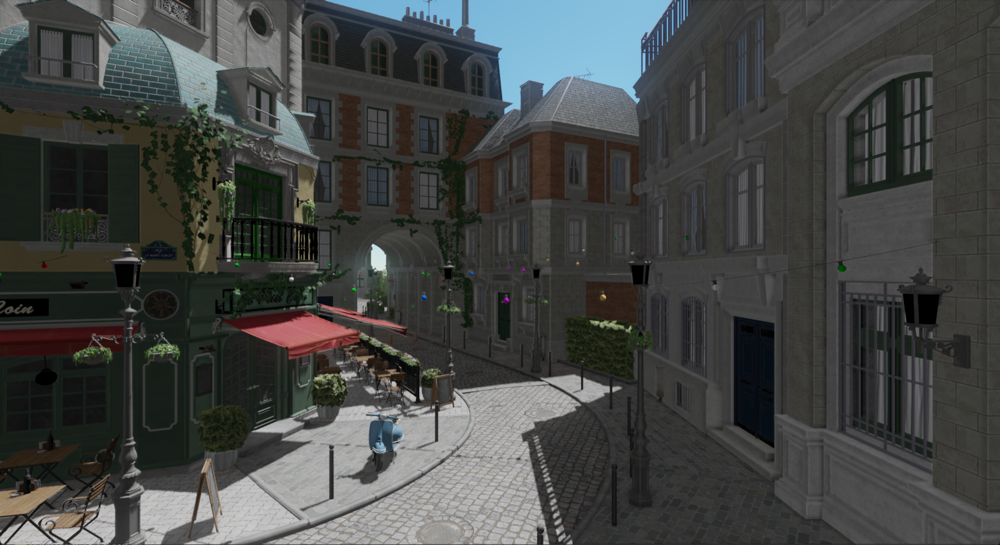

# Ifrit-v2

Some toys about real-time rendering. Currently, it contains:

- **Soft-Renderer**: CUDA / Multithreaded CPU Software Rasterizer & Ray-tracer, with JIT support.
- **Syaro**: Deferred Renderer with Nanite-styled Cluster Level of Details.


| <center>Software Renderer / Mesh Shading</center>                        | <center>Software Renderer / CUDA Renderer</center> |
| ------------------------------------------------------- | --------------------------------- |
|                              |        |
| <center>**Syaro / Cull Rasterize Visibility Buffer (R32_UINT)**</center> | <center>**Syaro / Final Output**</center>          |
|                         |      |


Check  **[`GALLERY.md`](./docs/gallery.md)** for more examples.

Successor to following repos: [Ifrit](https://github.com/Aeroraven/Ifrit), [Aria](https://github.com/Aeroraven/Aria) , [Iris (Tiny Renderer CPP)](https://github.com/Aeroraven/Stargazer/tree/main/ComputerGraphics/Iris)  & [Iris (Tiny Renderer C#)](https://github.com/Aeroraven/Stargazer/tree/main/ComputerGraphics/TinyRenderer)


## 1. Features Supported

### 1.1 Parallelized Soft Renderer

- Parallelized rasterization & ray-tracing pipeline, with GPU (CUDA) & Multithreaded CPU (SIMD) support
- Support mesh shading pipeline (mesh  shaders), and raytracing shaders (like miss shader)
- Support just-in-time compilation of HLSL SPIR-V shader code.
- Covers culling (including contribution culling), MSAA (8x), mipmapping,  anisotropic filtering and shader derivatives (`ddx` & `ddy`)
- Support texture sampling & cube mapping and texture lods.
- For implementation details and performance, check [here](./projects/softgraphics/readme.md)


### 1.2 Syaro: Virtual-Geometry-based Deferred Renderer

- Refactored version for [my original renderer](https://github.com/Aeroraven/Aria), improving pass management, synchronization primitives and descriptor bindings.

  - Bindless Descriptors
  - Dynamic Rendering
  - Render Hardware Interface
  - Render Graph

- Reproduced some features mentioned in Nanite's report: Two-pass occlusion culling, Mesh LoDs, Compute-shader-based SW rasterization.

- Some extra features supported:

  - Horizon-Based Ambient Occlusion
  - Cascaded Shadow Mapping
  - Temporal Anti-aliasing
  - Convolution Bloom (Fast Fourier Transform)
    

## 2. Setup / Run

> **WARN**: **Compiling files inside `dev` branch might yield UNEXPECTED result. (Known bugs are NOT resolved yet)**  

### 2.1 Clone the Repository

```bash
git clone https://github.com/Aeroraven/Ifrit-v2.git --recursive 
```

### 2.2 Install Dependencies

Following dependencies should be manually configured. Other dependencies will be configured via submodule.

- OpenGL >= 4.6 
- CMake >= 3.24
- MSVC >= 19.29

**Syaro**

- Vulkan SDK 1.3 (with shaderc combined)
  - Core Features 1.3
  - with `EXT_mesh_shader` extension
  - with `KHR_ray_tracing` extension (3 related extensions included)

**Soft Renderer** 

- LLVM >= 11.0
- CUDA >= 12.5
  - Known compiler issues with CUDA 12.4 with MSVC compiler

### 2.3 Quick Start For Syaro Demo

```shell
cmake -S . -B ./build
cmake --build ./build
```

To run the demo

- Download `lumberyard-bistro` , convert it into `gltf` format with name 'untitled.gltf', then place it in the `project/demo/Asset/Bistro` directory, with dds textures in `textures` subfolder.

```shell
./bin/ifrit.demo
```


## 3. References & Acknowledgements

See [ACKNOWLEDGEMENTS.md](./ACKNOWLEDGEMENTS.md) for more details.

## 4. License

Licensed under [AGPL-v3 License (or later)](https://www.gnu.org/licenses/agpl-3.0.en.html). The copy for license can be found in the root directory. 

