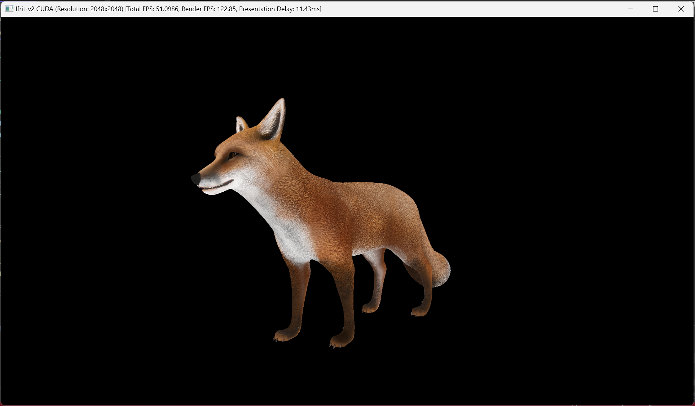
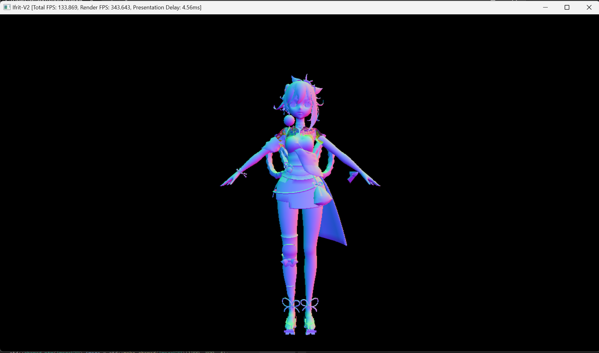
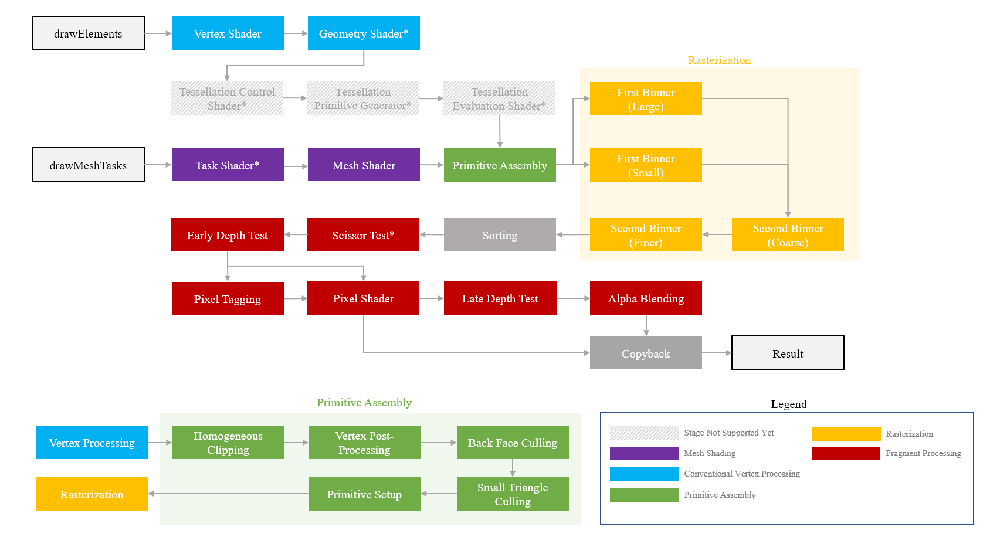
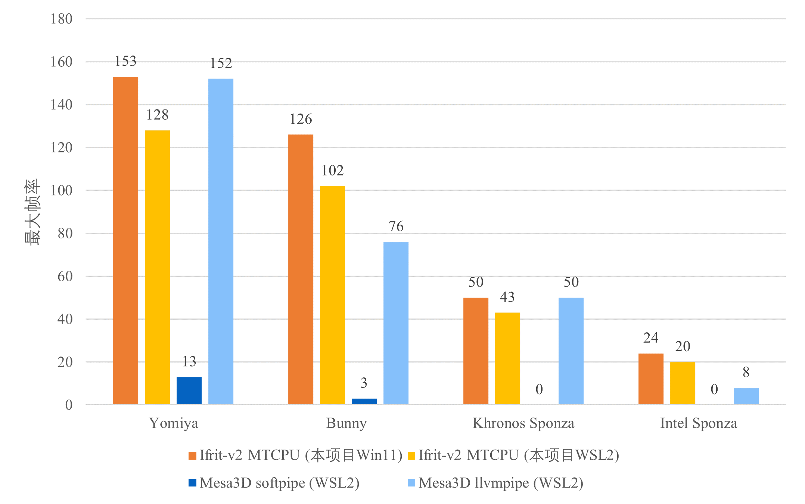

# Ifrit-v2

GPU/CPU-Parallelized tile-based software rasterizer.







Check  **[`gallery.md`](./docs/gallery.md)** for **[More Example Pictures](./gallery.md)**


Successor to following repos:

 - [Ifrit](https://github.com/Aeroraven/Ifrit)
 - [Iris (TinyRenderer CPP)](https://github.com/Aeroraven/Stargazer/tree/main/ComputerGraphics/Iris)
 - [Iris (TinyRenderer C#)](https://github.com/Aeroraven/Stargazer/tree/main/ComputerGraphics/TinyRenderer)


## 整体框架和支持特性

下图展示了CUDA渲染器管道的总体框架（有些与其多线程CPU版本不同），带星号标记的阶段是可选的。

**注意：**此项目不是硬件图形管道（如IMR或TBDR架构）的精确复制。它只是一个玩具或基本理解的教程。

✅ 可用 | 🟦 有限支持 (正在测试) | 🟨 不稳定 (正在测试) | 🟥 TODO

| 特性                                         | [Iris Renderer](https://github.com/Aeroraven/Stargazer/tree/main/ComputerGraphics/Iris)(旧版本) | Ifrit-v2 多线程CPU | Ifrit-v2  CUDA |
| -------------------------------------------- | ------------------------------------------------------------ | ------------------ | -------------- |
| 🔗 **支持的编程语言**                         |                                                              |                    |                |
| C++ 原生                                     | ✅                                                            | ✅                  | ✅              |
| C++ 动态链接                                 | 🟥                                                            | 🟦                  | 🟥              |
| .NET 运行库 (`C#` 支持)                      | 🟥                                                            | 🟦                  | 🟥              |
| 🔗 **Shader 语言**                            |                                                              |                    |                |
| 内置类                                       | ✅                                                            | ✅                  | ✅              |
| SPIR-V 二进制文件 / HLSL                     | 🟥                                                            | 🟦 (JIT运行)        | 🟥              |
| SPIR-V 二进制文件 / GLSL                     | 🟥                                                            | 🟥                  | 🟥              |
| 🚀 **光线追踪 / 性能**                        |                                                              |                    |                |
| 单指令多数据(SIMD) 指令 / 单指令多线程(SIMT) | 🟥                                                            | ✅                  | 🟥              |
| 加速结构 (BVH)                               | 🟥                                                            | ✅                  | 🟥              |
| 无锁同步                                     | 🟥                                                            | ✅                  | ⬜ 没有需求     |
| 🔦 **光线追踪 / 管线**                        |                                                              |                    |                |
| 加速结构遍历                                 | 🟥                                                            | ✅                  | 🟥              |
| 表面区域启发 (SAH)                           | 🟥                                                            | ✅                  | 🟥              |
| 可编程光线生成(Raygen)着色器                 | 🟥                                                            | ✅                  | 🟥              |
| 可编程最近命中(Closest Hit)着色器            | 🟥                                                            | ✅                  | 🟥              |
| 可编程未命中(Miss)着色器                     | 🟥                                                            | ✅                  | 🟥              |
| 🚀 **光栅化 / 性能**                          |                                                              |                    |                |
| 多线程                                       | 🟥                                                            | ✅                  | ✅              |
| 单指令多数据(SIMD) 指令 / 单指令多线程(SIMT) | 🟥                                                            | ✅                  | ✅              |
| 内存流与计算流重叠                           | ⬜ 不适用CPU                                                  | ⬜ 不适用CPU        | ✅              |
| 动态Tile列表                                 | 🟥                                                            | ✅                  | ✅              |
| 无锁同步                                     | 🟥                                                            | ✅                  | ⬜ 没有需求     |
| 💡 **光栅化 / 性能**                          |                                                              |                    |                |
| 渲染顺序                                     | ✅                                                            | ✅                  | ✅              |
| 💡 **光栅化 / 管线**                          |                                                              |                    |                |
| 可编程顶点着色器                             | ✅                                                            | ✅                  | ✅              |
| 可编程像素着色器                             | ✅                                                            | ✅                  | ✅              |
| 可编程几何着色器                             | 🟥                                                            | 🟥                  | 🟦              |
| 可编程网格(Mesh)着色器                       | 🟥                                                            | 🟥                  | 🟦              |
| 可编程任务(Task)着色器                       | 🟥                                                            | 🟥                  | 🟦              |
| 混合                                         | 🟥                                                            | ✅                  | ✅              |
| 深度测试                                     | ✅                                                            | ✅                  | ✅              |
| 深度测试函数                                 | 🟥                                                            | ✅                  | ✅              |
| 标记缓冲 (Tag Buffer)                        | 🟥                                                            | ✅                  | ✅              |
| Early-Z 深度测试                             | ✅                                                            | ✅                  | ✅              |
| Late-Z 深度测试 (深度替换和像素丢弃)         | 🟥                                                            | 🟥                  | ✅              |
| 裁剪测试                                     | 🟥                                                            | 🟥                  | ✅              |
| 背面剔除                                     | ✅                                                            | ✅                  | ✅              |
| 视锥剔除                                     | 🟥                                                            | ✅                  | ✅              |
| 齐次裁剪                                     | 🟥                                                            | ✅                  | ✅              |
| 小三角形剔除                                 | 🟥                                                            | ✅                  | ✅              |
| 透视正确插值                                 | 🟥                                                            | ✅                  | ✅              |
| 着色器导数 `dFdx` `dFdy`<br/>辅助调用        | 🟥                                                            | 🟨                  | 🟦              |
| 多重采样                                     | 🟥                                                            | 🟥                  | 🟦 8x MSAA      |
| 💡 **光栅化 / 多边形模式**                    |                                                              |                    |                |
| 填充三角形                                   | ✅                                                            | ✅                  | ✅              |
| 线框                                         | 🟥                                                            | 🟥                  | 🟦              |
| 点                                           | 🟥                                                            | 🟥                  | 🟦              |
| 🖼️ **纹理**                                   |                                                              |                    |                |
| 采样器                                       | 🟥                                                            | 🟥                  | ✅              |
| Blit                                         | 🟥                                                            | 🟥                  | ✅              |
| Mipmap                                       | 🟥                                                            | 🟥                  | ✅              |
| 过滤 (Filter)                                | 🟥                                                            | 🟥                  | ✅              |
| 采样器地址模式                               | 🟥                                                            | 🟥                  | ✅              |
| LOD 偏置                                     | 🟥                                                            | 🟥                  | ✅              |
| 各向异性过滤                                 | 🟥                                                            | 🟥                  | 🟦              |
| 立方体贴图                                   | 🟥                                                            | 🟥                  | ✅              |
| 🖥️ **显示**                                   |                                                              |                    |                |
| 终端 ASCII                                   | 🟥                                                            | ✅                  | ✅              |
| 终端带颜色方块                               | 🟥                                                            | ✅                  | ✅              |


## 性能

### 帧率比较 (FPS)  版本 2

#### 软件渲染性能比较

对2048x2048 RGBA FP32图像+2048x2048 FP32深度附件进行的测试。演示阶段（通过OpenGL显示纹理）的时间消耗被忽略。请注意，管道中的一些三角形**可能会被剔除或裁剪**。

| CPU软件管线 / 模型 / 帧率         | Yomiya | Bunny | Khronos Sponza | Intel Sponza |
| --------------------------------- | ------ | ----- | -------------- | ------------ |
| **Windows (MSVC)**                |        |       |                |              |
| Ifrit-v2 MTCPU (本项目)           | 153    | 126   | 50             | 24           |
| **WSL2 (Ubuntu 20.04 LTS / GCC)** |        |       |                |              |
| Ifrit-v2 MTCPU (本项目)           | 128    | 102   | 43             | 20           |
| Mesa3D softpipe                   | 13     | 3     | *              | *            |
| Mesa3D llvmpipe                   | 152    | 76    | 50             | 8            |



 *. 帧时间大于1000ms（FPS<1）


#### 颜色和深度缓冲尺寸对性能的影响

在多线程CPU渲染器（1个主线程+16个工作线程）上执行的测试，使用Vulkan特定HLSL着色器的即时（JIT）编译（以SPIR-V二进制格式编译）。

| 3D模型 / 帧率                             | 512 x 512 | 1024 x 1024 | 2048 x 2048 | 4096 x 4096 |
| ----------------------------------------- | --------- | ----------- | ----------- | ----------- |
| Kirara / Genshin Impact (37 k)            | 1219      | 480         | 124         | 28          |
| Evil Neuro (55.9 k)                       | 606       | 398         | 120         | 31          |
| Flandre Scarlet / Touhou Project (96.1 k) | 502       | 237         | 82          | 19          |
| Miyako / Blue Archive (346.1 k)           | 106       | 72          | 43          | 13          |


#### 多线程、优化和执行策略的影响

对2048x2048 RGBA FP32图像+2048x2048 FP32深度附件进行的测试。演示阶段（通过OpenGL显示纹理）的时间消耗被忽略。请注意，管道中的一些三角形**可能会被剔除或裁剪**。

| 3D模型 / 帧率                               | Yomiya     | Bunny      | Khronos Sponza | Intel Sponza |
| ------------------------------------------- | ---------- | ---------- | -------------- | ------------ |
| 三角形数量                                  | 70275      | 208353     | 786801         | 11241912     |
| **结构性优化 和 即时编译(JIT)**             |            |            |                |              |
| 单线程CPU 版本 v1                           | 38         | 20         | 2              | 1            |
| 多线程CPU 版本 v1                           | 80         | 80         | 10             | 2            |
| CUDA 版本 v1                                | 2857       | 2272       | 500            | 198          |
| 单线程CPU 优化后 v2 (SPIR-V HLSL 着色器JIT) | 56 (+47%)  | 37 (+85%)  | 7 (+250%)      | 4 (+300%)    |
| 多线程CPU 优化后 v2 (SPIR-V HLSL 着色器JIT) | 153 (+91%) | 125 (+56%) | 50 (+400%)     | 24 (+1100%)  |
| 单线程CPU 优化后 v2 (C++ 类继承)            | 56 (+47%)  | 37 (+85%)  | 7 (+250%)      | 4 (+300%)    |
| 多线程CPU 优化后 v2 (C++ 类继承)            | 153 (+91%) | 126 (+58%) | 50 (+400%)     | 24 (+1100%)  |
| **管线优化**                                |            |            |                |              |
| 当前版本                                    | 153        | 126        | 50             | 24           |
| 移除标记缓冲(Tag Buffer)                    | 119 (-22%) | 98 (-22%)  | 24 (-52%)      | 17 (-29%)    |
| 移除层次性Tiling                            | 111 (-26%) | 86 (-32%)  | 19 (-62%)      | 17 (-29%)    |

※ **C++ 类继承**: 着色器使用虚拟继承提前编码和编译。

※ **SPIR-V HLSL 着色器JIT**: 所有着色器代码都使用“glslc”编译成二进制形式。HLSL源代码是以“Vulkan特定”风格编写的。即时（JIT）编译使用LLVM 10作为后端和手动IR映射（共享库使用`mingw-w64`编译）。应用程序在“msvc”中运行。


#### 数据并行

对2048x2048 RGBA FP32图像+2048x2048 FP32深度附件进行的测试。演示阶段（通过OpenGL显示纹理）的时间消耗被忽略。请注意，管道中的一些三角形**可能会被剔除或裁剪**。

| 3D模型  / 帧率 | ST   | MT   | MT + SSE指令集 (128) | MT + AVX2指令集 (256) | 内存读写限制 | CUDA | 总线限制 |
| -------------- | ---- | ---- | -------------------- | --------------------- | ------------ | ---- | -------- |
| Khronos Sponza | 4    | 33   | 43                   | 50                    | 128          | 500  | 125      |

※ **单线程 (ST) 和多线程 (MT)**: 16 工作线程 (+1 主线程) 。

※ **SSE/AVX**：32位浮点数字被组织为支持SSE指令的4元素向量和支持AVX2指令的8元素向量。在这两种设置中都使用了融合乘加指令FMA指令集。对于单个对象运算，只使用SSE的4元素向量操作float3和float4类型。

- **内存读写限制(CPU上限)**：使用内存函数（`rep stosb`汇编指令）绘制附件时测量最大fps的一半。这近似衡量了CPU渲染器的性能上限。
- **总线限制(CUDA上限)**：将附件从本地设备（CUDA设备）复制回主机设备（CPU）时测量的最大fps。这在最后一步测量CUDA渲染器的性能上限（不考虑图形API互操作）


### 测试环境

- CPU: 12th Gen Intel(R) Core(TM) i9-12900H 
  - Test with 17 threads (1 master + 16 workers) + AVX2 Instructions
- GPU: NVIDIA GeForce RTX 3070 Ti Laptop GPU (Kernel parameters are optimized for the SPECIFIC test environment)
- Shading: World-space normal
- Compiler:  MSVC 19.29 + NVCC 12.6 (with O2 optimization)


## 依赖

See [Requirements & Build Instructions ](./docs/requirement.md)for more details.


## 运行

### 快速开始 (GCC / MinGW-w64)

> 警告：请确保已安装依赖项，**并且这将忽略项目中的所有CUDA代码。**
>注意：在cmake之前，应手动配置某些路径/包

```shell
# G++ (Linux)
cmake -S . -B ./build
cd build
make
# MinGW-w64 (Windows)
cmake -S . -B ./build -G "MinGW Makefiles"
cd build
mingw32-make
```

To run the demo

```shell
# For linux
export LD_LIBRARY_PATH=/path/to/Ifrit.Components.LLVMExec.so;$LD_LIBRARY_PATH
./core/bin/IfritMain
```


### 完整选项

See [Requirements & Build Instructions ](./docs/requirement.md)for more details.


## 参考

For models / open source code references, check `licenses` folder. Thanks for following resources.

[1]. https://tayfunkayhan.wordpress.com/2019/07/26/chasing-triangles-in-a-tile-based-rasterizer/

[2]. https://www.slideshare.net/slideshow/optimizing-the-graphics-pipeline-with-compute-gdc-2016/59747720

[3]. https://docs.nvidia.com/cuda/cuda-c-programming-guide/

[4]. https://github.com/zeux/meshoptimizer

[5]. https://llvm.org/docs/LangRef.html

[6]. https://www.mesa3d.org/