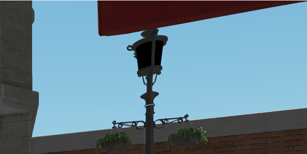

# Ifrit-v2 /  TODO 

### 2025.04

- VkGraphics: 修复AllocateCommandBuffer导致的内存泄漏 (250404)
  - 参考：https://developer.download.nvidia.com/gameworks/events/GDC2016/Vulkan_Essentials_GDC16_tlorach.pdf#page=25.00

### 2025.03

- RHI: RHI资源引用计数和待删除队列 (250325)

- Syaro: 修复错误的Cluster Group Culling (250324)

### 2025.01
- Syaro: 缓解LoD切换时的顶点属性突变 (250115)

  | After Fixing                                       | Before Fixing                                      |
  | -------------------------------------------------- | -------------------------------------------------- |
  |  |  |

- Syaro: 由HiZ采样位置错误导致的图元丢失 (250111)

  | After Fixing                                                 | Before Fixing                                                |
  | ------------------------------------------------------------ | ------------------------------------------------------------ |
  |  |  |

- Syaro: 由软渲染采样位置错误导致的图元丢失 (250111)

  | After Fixing                                                 | Before Fixing                                                |
  | ------------------------------------------------------------ | ------------------------------------------------------------ |
  |  |  |

  

- Syaro: FSR2 移动时的闪烁和拖影 (250110)

- Syaro: 由引用已析构的对象造成的第一帧的View信息无效. (250103)

- Syaro: CSM UV 溢出, 导致错误的AABB初始化 (250103)

- Syaro: GLTF 错误的节点变换 (250103)

- Syaro: CSM 移动时闪烁

  