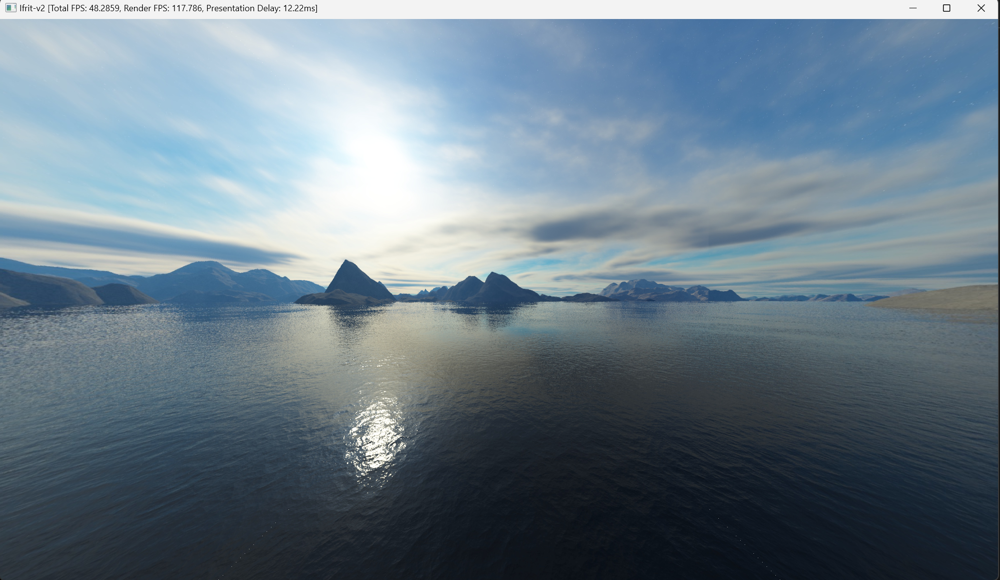
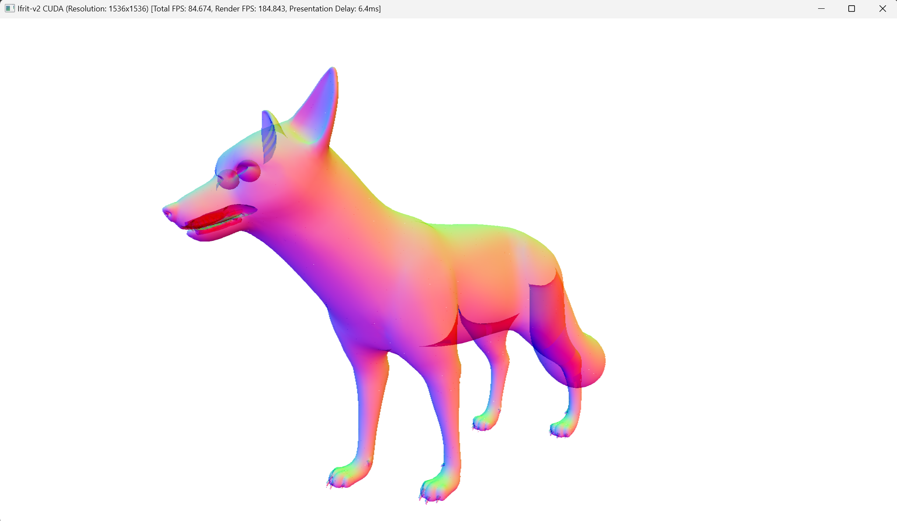
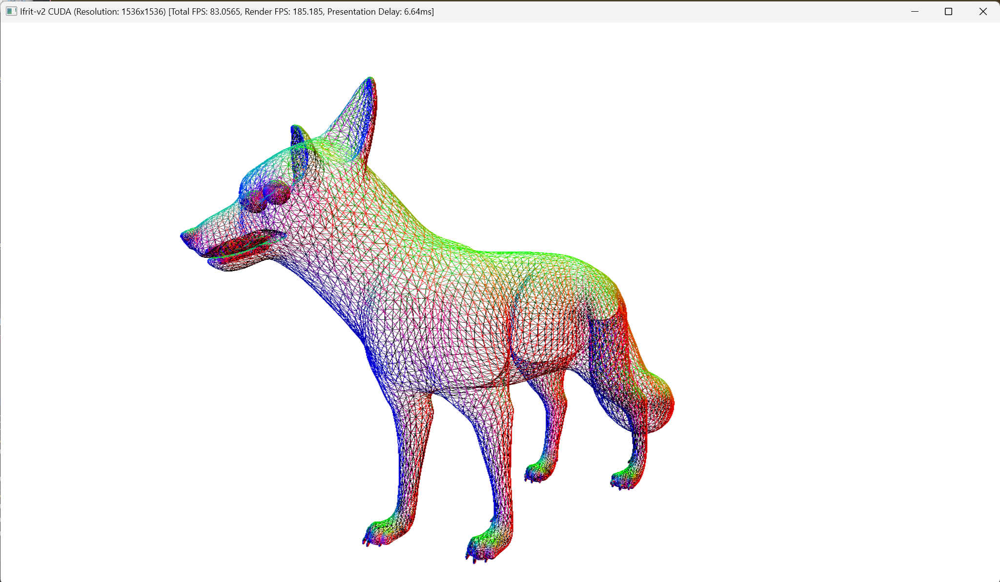
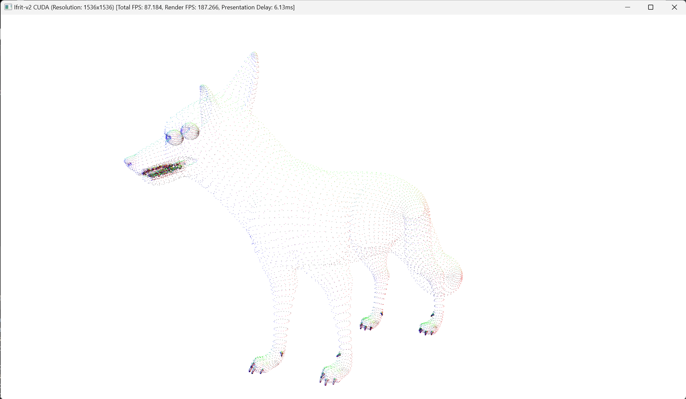
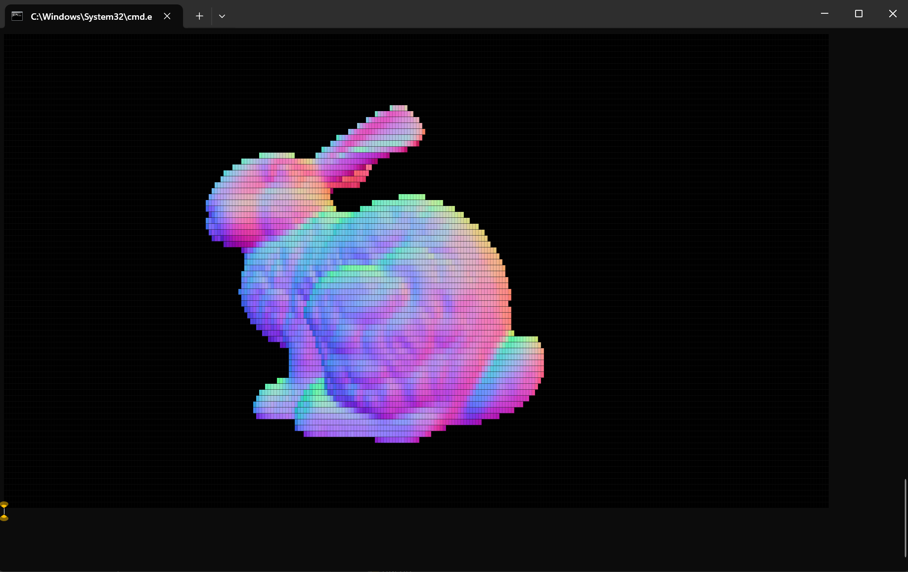
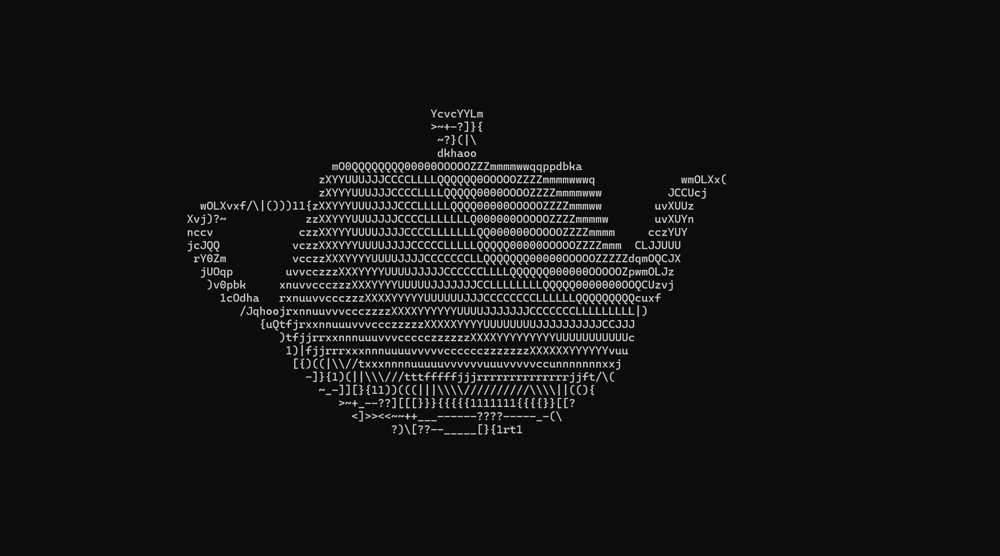

# Ifrit-v2 / Gallery

## Cube Mapping

## Mip-maps (Level of Details)

## Alpha Blending

## Polygon Modes

### Wireframe

### Points

## View Layer

### Colored Terminal Output

### ASCII Output

